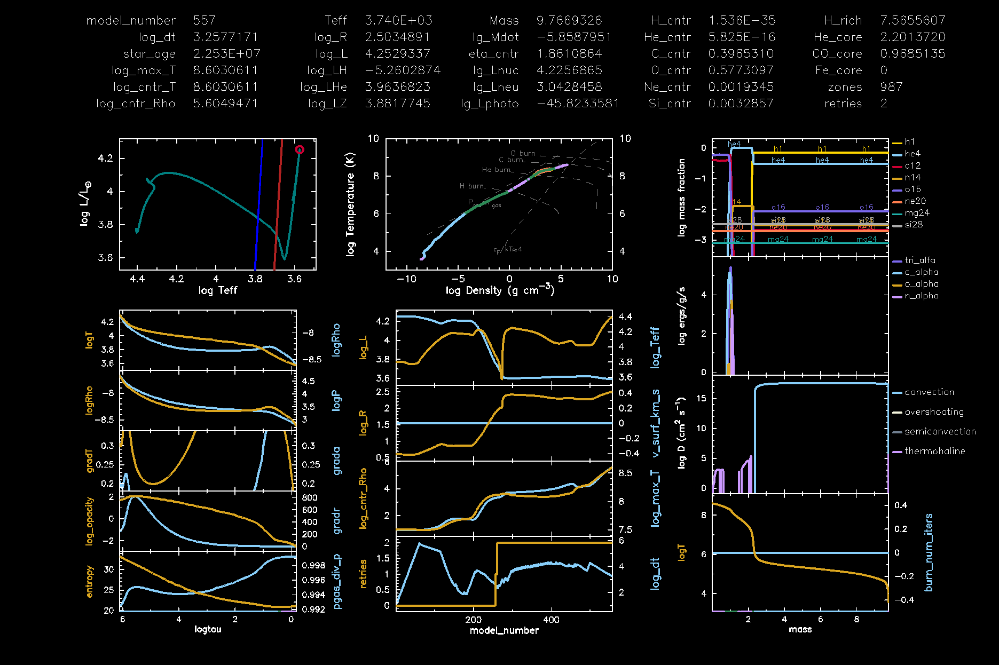
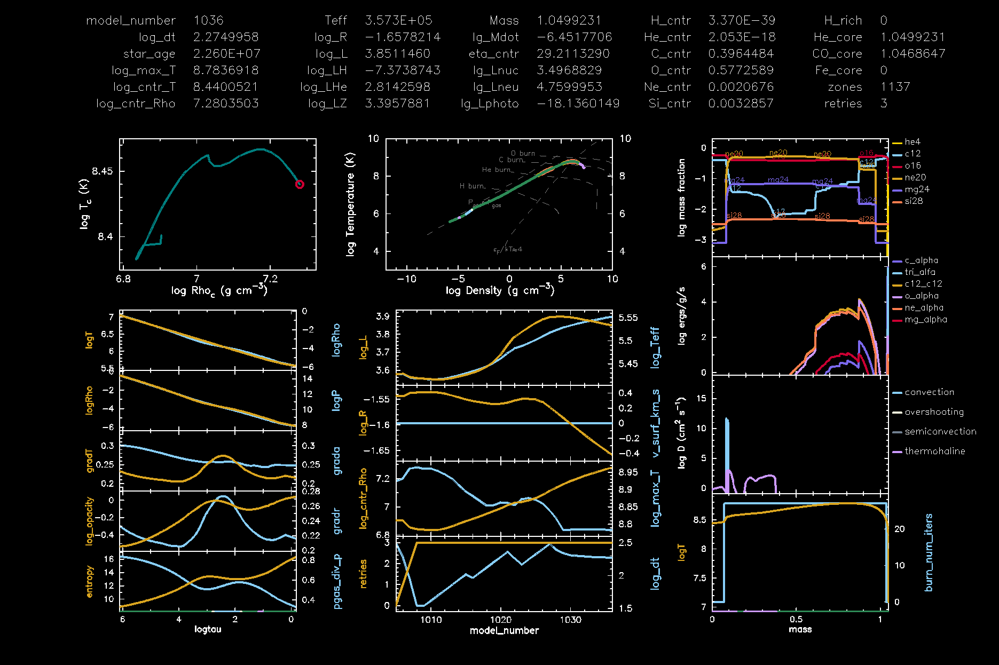
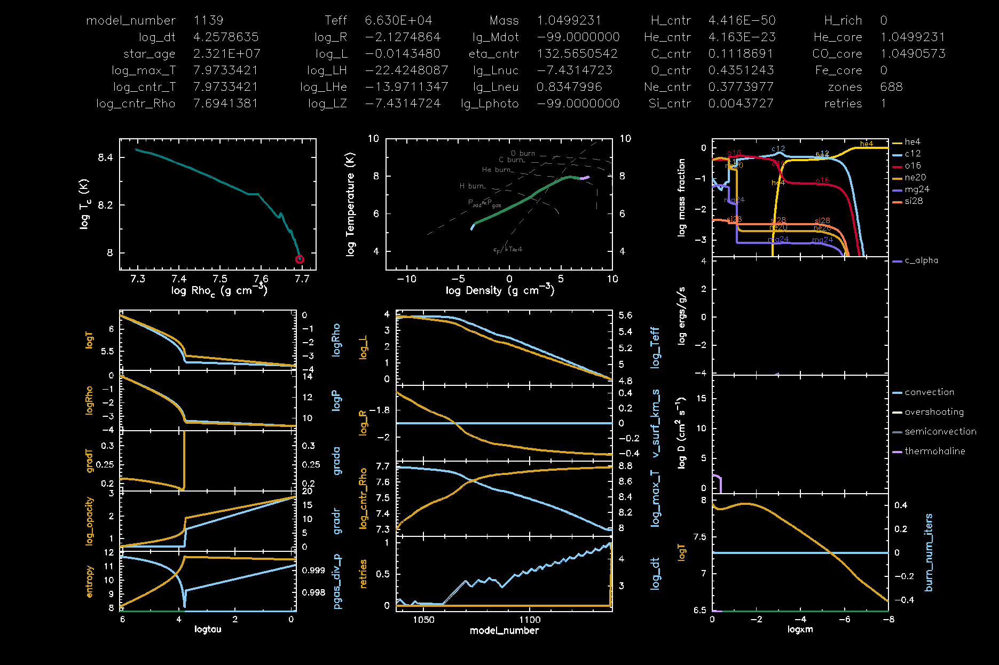

.. _make_o_ne_wd:

************
make_o_ne_wd
************

This test case produces a 1.05 Msun oxygen-neon-magnesium white dwarf using stellar engineering.

This test case has 5 parts. Click to see a larger version of a plot.

* Part 1 (``inlist_zams``) creates a 10 Msun, Z = 0.02 metallicity, pre-main sequence star and evolves to the zero-age main sequence.

* Part 2 (``inlist_to_agb``) continues the evolution until the temperature in any cell exceeds log10(T/K) = 8.6. At this point the carbon-oxygen core is 0.97 Msun:

* Part 3 (``inlist_c_burn``) continues the evolution, removing all but 1.05 Msun of material with a ``Blocker_scaling_factor = 50`` wind. Meanwhile, carbon ignites off-center twice, the second time producing a convectively bounded flame front that propagates toward the center that turns the carbon-oxygen rich material into a neon-oxygen rich material. A little overshooting aids the propgation speed of the carbon burning front. A lot of well-timed mass loss is necessary such that the interior conditions reach carbon ignition, and enough of the envelope is removed so that the model doesn't get in trouble with trying to have a high mdot at the same time as strong carbon burning.  If the wind is too strong from too early, then just get a massive carbon-oxygen white dwarf. If the wind is too weak or starts too late, then errors can occur with surface ejection velocities greater than the speed of light. This part terminates when the mass of neon exceeds 0.3 Msun:

.. image:: ../../../star/test_suite/make_o_ne_wd/docs/inlist_c_burn.png
   :width: 100%

* Part 4 (``inlist_o_ne_wd``) continues the evolution, with the convectively bounded carbon flame propagating towards the center. The run terminates when the mass of helium drops below 1e-3 Msun:

* Part 5 (``inlist_settle_envelope``) continues the evolution, activating element diffusion to produce a nearly pure helium atmosphere:

The plots above were made with the provided ``inist_pgstar`` by setting ``Grid1_win_flag = .true.`` and ``Grid1_file_flag = .true.``.

Last-Updated: 29Jun2021 (MESA 7f132f41) by adamjermyn.
