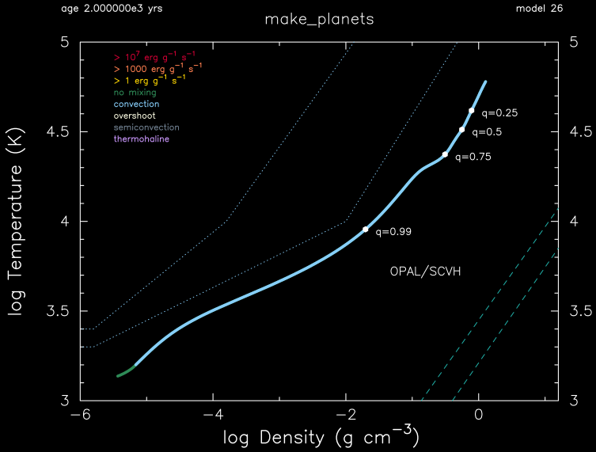
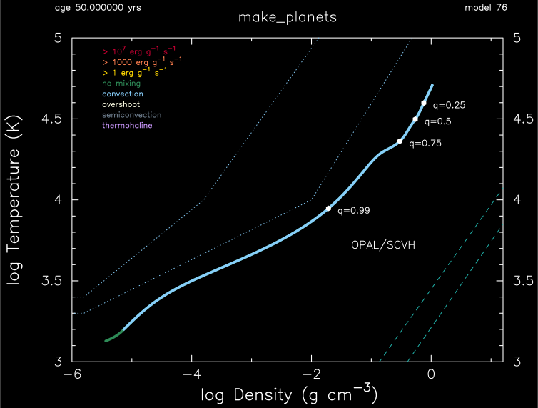
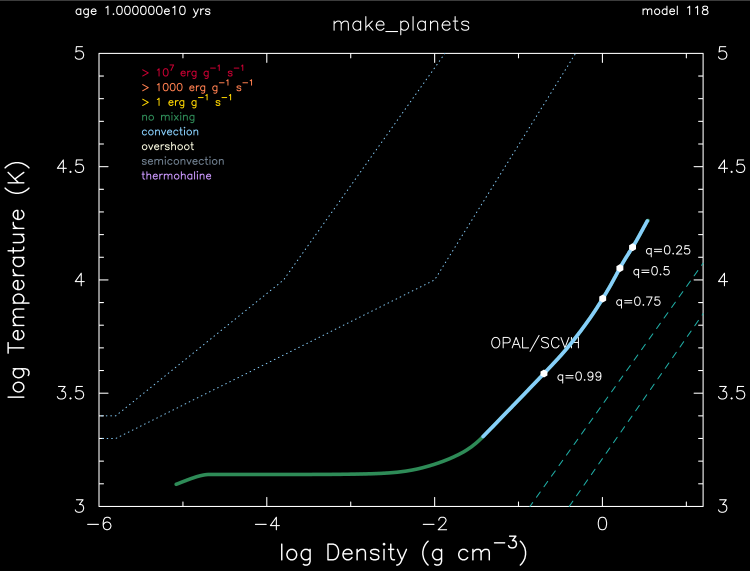

.. _make_planets:

************
make_planets
************

This test case shows an example of a 1 Mjup model with a 10 Mearth core that is irradiated and evolved for 10Gyr.

This test case has 3 part. Click to see a larger version of a plot.

* Part 1 (``inlist_create``) creates a 0.9685 Mjup, 2.0 Rjup, Z=0.02 metallicity, Y=0.24 helium mass fraction initial model which is evolved for 50 years.

* Part 2 (``inlist_core``) adds a 10 Mearth core with a density of 10 g cm\ :sup:`-3` and then further evolves the model for 2000 years.

* Part 3 (``inlist_evolve``) continuously deposits a flux of 5.5e8 erg cm\ :sup:`-2` s\ :sup:`-1` at a column depth of 300 cmcm\ :sup:`2` g cm\ :sup:`-3` and evolves the model for 10 billion years:

555501654.562d0 ! 1.d9 erg/cm^2/s

pgstar commands used for the plots above:

.. code-block:: console

 &pgstar

  file_white_on_black_flag = .true. ! white_on_black flags -- true means white foreground color on black background
  !file_device = 'png'            ! png
  !file_extension = 'png'

  file_device = 'vcps'          ! postscript
  file_extension = 'ps'

  pgstar_interval = 10

 TRho_Profile_win_flag = .true.
 TRho_Profile_win_width = 12
 TRho_Profile_win_aspect_ratio = 0.75 
 TRho_Profile_txt_scale = 1.0
 TRho_Profile_title = 'make_planets'      
         
 show_TRho_Profile_legend = .true.
 TRho_Profile_legend_coord = 0.07
 TRho_Profile_legend_fjust = 0.0
 TRho_Profile_legend_disp1 = -2.0
 TRho_Profile_legend_del_disp = -1.3

  show_TRho_Profile_eos_regions = .true.
  show_TRho_Profile_degeneracy_line = .false.
  show_TRho_Profile_Pgas_Prad_line = .false.
      
  TRho_Profile_xmin = -6.0
  TRho_Profile_xmax = 1.2
  TRho_Profile_ymin = 3.0
  TRho_Profile_ymax = 5.0

  show_TRho_Profile_mass_locs = .true.
  num_profile_mass_points = 4

  profile_mass_point_q(1) = 0.25
  profile_mass_point_color_index(1) = 1
  profile_mass_point_symbol(1) = -6
  profile_mass_point_symbol_scale(1) = 1.0
  profile_mass_point_str(1) = '  q=0.25'
  profile_mass_point_str_clr(1) = 1
  profile_mass_point_str_scale(1) = 0.8
         
  profile_mass_point_q(2) = 0.5
  profile_mass_point_color_index(2) = 1
  profile_mass_point_symbol(2) = -6
  profile_mass_point_symbol_scale(2) = 1.0
  profile_mass_point_str(2) = '  q=0.5'
  profile_mass_point_str_clr(2) = 1
  profile_mass_point_str_scale(2) = 0.8
         
  profile_mass_point_q(3) = 0.75
  profile_mass_point_color_index(3) = 1
  profile_mass_point_symbol(3) = -6
  profile_mass_point_symbol_scale(3) = 1.0
  profile_mass_point_str(3) = '  q=0.75'
  profile_mass_point_str_clr(3) = 1
  profile_mass_point_str_scale(3) = 0.8

  profile_mass_point_q(4) = 0.99
  profile_mass_point_color_index(4) = 1
  profile_mass_point_symbol(4) = -6
  profile_mass_point_symbol_scale(4) = 1.0
  profile_mass_point_str(4) = '  q=0.99'
  profile_mass_point_str_clr(4) = 1
  profile_mass_point_str_scale(4) = 0.8

  TRho_Profile_file_flag = .true.
  TRho_Profile_file_dir = 'pgstar_out'
  TRho_Profile_file_prefix = 'trho_'
  TRho_Profile_file_interval = 10000

 / ! end of pgstar namelist

Last-Updated: 18Jun2021 (MESA e2acbc2) by fxt.
