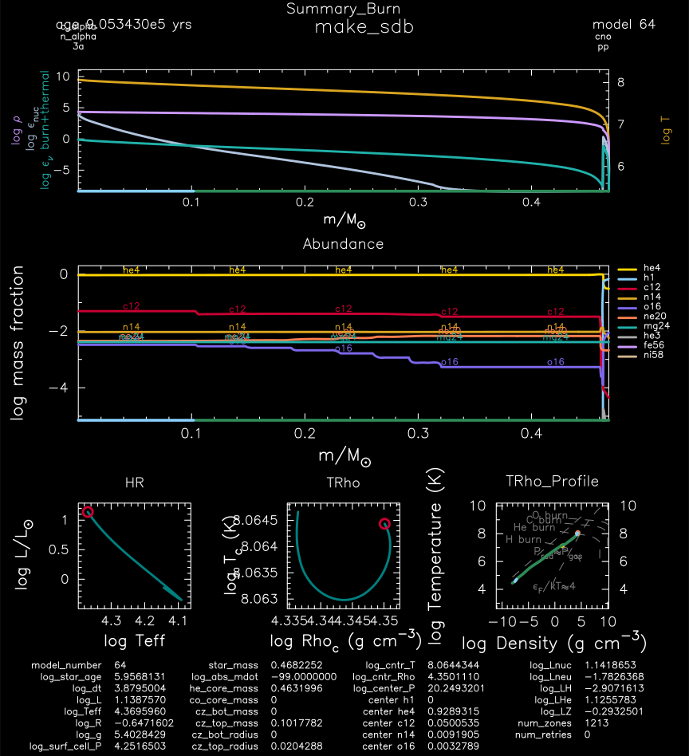

.. _make_sdb:

********
make_sdb
********

This test case shows an example of making a 0.4 Msun, Z=0.02 metallicity, helium model - a B-type subdwarf (sdB) star.

This test case has 1 part. Click to see a larger version of a plot.

* Part 1 (``inlist_make_sdb``) first loads a prebuilt helium core model ``start_core_he_burn.mod`` that comes from the :ref:`1M_pre_ms_to_wd` test case (specifically ``inlist_to_end_core_he_burn`` is modified to stop when the mass fraction of helium dropes below 0.95). Then the hydrogen envelope is removed with ``relax_initial_mass_to_remove_H_env = .true.`` as a model for a common envelope event removal of the envelope. The model is then evolved until the mass fraction of carbon rises above 0.05 :

pgstar commands used for the plot above:

.. code-block:: console

 &pgstar

  file_white_on_black_flag = .true. ! white_on_black flags -- true means white foreground color on black background
  !file_device = 'png'            ! png
  !file_extension = 'png'

  file_device = 'vcps'          ! postscript
  file_extension = 'ps'

  pgstar_interval = 10

  Grid_win_flag(8) = .true. ! Summary_Burn, Abundance, HR, TRho, TRho_Profile, Text_Summary1
  Grid_win_width(8) = 12
  Grid_title(8) = 'make_sdb'

  Grid_file_flag(8) = .true.
  Grid_file_dir(8) = 'pgstar_out'
  Grid_file_prefix(8) = 'grid_'
  Grid_file_interval(8) = 10000

 / ! end of pgstar namelist

Last-Updated: 20Jun2021 (MESA e2acbc2) by fxt.
