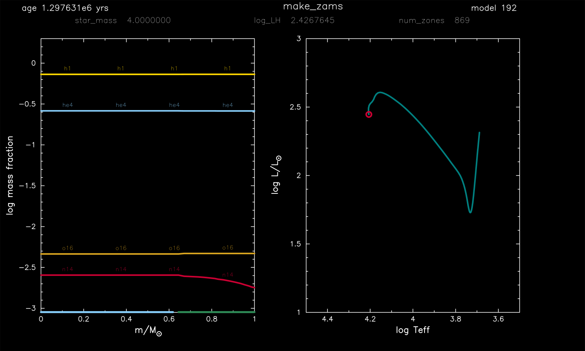

.. _make_zams:

*********
make_zams
*********

This test case shows an example of creating a 4 |Msun|, Z = 0.01 metallicity, pre-main sequence model and evolving it to the zero age main sequence.

This test case has 1 part. Click to see a larger version of a plot.

* Part 1 (``inlist_zams``) creates a 4 |Msun|, Z = 0.01 metallicity, pre-main sequence model and evolves the model to the zero age main sequence, terminating when Lnuc / L = 0.9.

pgstar commands used for the plot above:

.. literalinclude:: ../../../star/test_suite/make_zams/inlist_zams
  :language: console
  :start-at: &pgstar
  :end-at: ! end of pgstar namelist

Last-Updated: 20Jun2021 (MESA e2acbc2) by fxt.

Last-Run: 22Oct2024 (MESA 9b2017ca) by pmocz on C916PXT6XW in 46 seconds using 8 threads.
