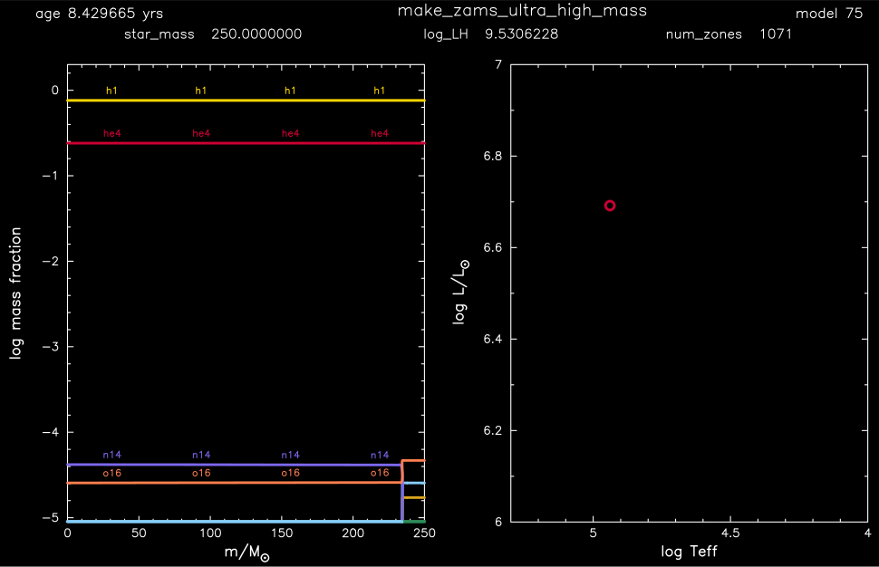

.. _make_zams_ultra_high_mass:

*************************
make_zams_ultra_high_mass
*************************

This test case shows an example of creating a 250 Msun, Z = 1e-4 metallicity, model close to the main sequence.

This test case has 1 part. Click to see a larger version of a plot.

* Part 1 (``inlist_zams_ultra_high_mass``) loads the pre-built 90 Msun, Z = 1e-4 metallicity, model ``late_pre_zams_90M.mod``. This initial model is then relaxed to 250 Msun using ``relax_initial_mass_scale = .true.``. At the 250 Msun point, the model already exceeds the termination criteria of Lnuc/L = 0.9 and there is no evolution in the HR diagram: 

pgstar commands used for the plot above:

.. code-block:: console

 &pgstar

  file_white_on_black_flag = .true. ! white_on_black flags -- true means white foreground color on black background
  !file_device = 'png'            ! png
  !file_extension = 'png'

  file_device = 'vcps'          ! postscript
  file_extension = 'ps'

  pgstar_interval = 10

  Abundance_win_flag = .false.
  Abundance_win_width = 15
  Abundance_win_aspect_ratio = 0.75

  Abundance_title = ''
  Abundance_num_isos_to_show = 6

  Abundance_which_isos_to_show(1)  = 'h1'
  Abundance_which_isos_to_show(2)  = 'he3'
  Abundance_which_isos_to_show(3)  = 'he4'
  Abundance_which_isos_to_show(4)  = 'c12'
  Abundance_which_isos_to_show(5)  = 'n14'
  Abundance_which_isos_to_show(6)  = 'o16'

  num_abundance_line_labels = 4
  Abundance_line_txt_scale_factor = 1.0
  Abundance_legend_max_cnt = 0

  Abundance_xaxis_name = 'mass'
  Abundance_xaxis_reversed = .false.
  Abundance_xmin = 0.0
  Abundance_xmax = 1.0

  Abundance_log_mass_frac_min = -5.0
  Abundance_log_mass_frac_max =  0.3

  HR_win_flag = .false.
  HR_win_width = 12
  HR_win_aspect_ratio = 1.2 ! aspect_ratio = height/width
  HR_title = ''

  HR_logT_min = 4.0
  HR_logT_max = 5.3
  HR_logL_min = 6.0
  HR_logL_max = 7.0

  Text_Summary1_win_flag = .false.
  Text_Summary1_win_width = 10
  Text_Summary1_win_aspect_ratio = 0.15

  Text_Summary1_xleft = 0.01
  Text_Summary1_xright = 0.99
  Text_Summary1_ybot = 0.0
  Text_Summary1_ytop = 1.0
  Text_Summary1_txt_scale = 1.0

  Text_Summary1_num_rows = 1 ! <= 20
  Text_Summary1_num_cols = 3 ! <= 20
  Text_Summary1_name(:,:) = ''

  Text_Summary1_name(1,1) = 'star_mass'
  Text_Summary1_name(1,2) = 'log_LH'
  Text_Summary1_name(1,3) = 'num_zones'

  Grid1_title = 'make_zams'
  Grid1_win_flag = .true.
  Grid1_win_width = 15
  Grid1_win_aspect_ratio = 0.6

  Grid1_plot_name(:) = ''
  Grid1_plot_row(:) = 1           ! number from 1 at top
  Grid1_plot_rowspan(:) = 1       ! plot spans this number of rows
  Grid1_plot_col(:) =  1          ! number from 1 at left
  Grid1_plot_colspan(:) = 1       ! plot spans this number of columns
  Grid1_plot_pad_left(:) = 0.0    ! fraction of full window width for padding on left
  Grid1_plot_pad_right(:) = 0.0   ! fraction of full window width for padding on right
  Grid1_plot_pad_top(:) = 0.0     ! fraction of full window height for padding at top
  Grid1_plot_pad_bot(:) = 0.0     ! fraction of full window height for padding at bottom
  Grid1_txt_scale_factor(:) = 0.7 ! multiply txt_scale for subplot by this

  Grid1_num_cols = 6 ! divide plotting region into this many equal width cols
  Grid1_num_rows = 2 ! divide plotting region into this many equal height rows
  Grid1_num_plots = 10 ! <= 10

   pgstar_show_model_number = .true.
   pgstar_model_scale = 1.0
   pgstar_model_lw = 3
   pgstar_model_disp = 2.0
   pgstar_model_coord = 0.92
   pgstar_model_fjust = 1.0

   pgstar_show_age = .true.
   pgstar_age_scale = 1.0
   pgstar_age_lw = 3
   pgstar_age_disp = 2.0
   pgstar_age_coord = -0.10
   pgstar_age_fjust = 0.0

  Grid1_plot_name(1) = 'Text_Summary1'
  Grid1_plot_row(1) = 1           ! number from 1 at top
  Grid1_plot_rowspan(1) = 1       ! plot spans this number of rows
  Grid1_plot_col(1) =  1          ! number from 1 at left
  Grid1_plot_colspan(1) = 6       ! plot spans this number of columns

  Grid1_plot_pad_left(1) = -0.06    ! fraction of full window width for padding on left
  Grid1_plot_pad_right(1) = 0.05   ! fraction of full window width for padding on right
  Grid1_plot_pad_top(1) = -0.02     ! fraction of full window height for padding at top
  Grid1_plot_pad_bot(1) = 0.39     ! fraction of full window height for padding at bottom
  Grid1_txt_scale_factor(1) = 1.2 ! multiply txt_scale for subplot by this

  Grid1_plot_name(2) = 'Abundance'
  Grid1_plot_row(2) = 1           ! number from 1 at top
  Grid1_plot_rowspan(2) = 2       ! plot spans this number of rows
  Grid1_plot_col(2) =  1          ! number from 1 at left
  Grid1_plot_colspan(2) = 3       ! plot spans this number of columns

  Grid1_plot_pad_left(2) = -0.05    ! fraction of full window width for padding on left
  Grid1_plot_pad_right(2) = 0.10   ! fraction of full window width for padding on right
  Grid1_plot_pad_top(2) = 0.03     ! fraction of full window height for padding at top
  Grid1_plot_pad_bot(2) = 0.03     ! fraction of full window height for padding at bottom
  Grid1_txt_scale_factor(2) = 0.7 ! multiply txt_scale for subplot by this

  Grid1_plot_name(3) = 'HR'
  Grid1_plot_row(3) = 1          ! number from 1 at top
  Grid1_plot_rowspan(3) = 2       ! plot spans this number of rows
  Grid1_plot_col(3) =  5          ! Number from 1 at left
  Grid1_plot_colspan(3) = 3       ! plot spans this number of columns

  Grid1_plot_pad_left(3) = -0.15    ! fraction of full window width for padding on left
  Grid1_plot_pad_right(3) = 0.20   ! fraction of full window width for padding on right
  Grid1_plot_pad_top(3) = 0.03     ! fraction of full window height for padding at top
  Grid1_plot_pad_bot(3) = 0.03     ! fraction of full window height for padding at bottom
  Grid1_txt_scale_factor(3) = 0.7 ! multiply txt_scale for subplot by this

  Grid1_file_flag = .true.
  Grid1_file_dir = 'pgstar_out'
  Grid1_file_prefix = 'grid_'
  Grid1_file_interval = 10000
  Grid1_file_width = -1       ! (inches) negative means use same value as for window

 / ! end of pgstar namelist

Last-Updated: 20Jun2021 (MESA e2acbc2) by fxt.
