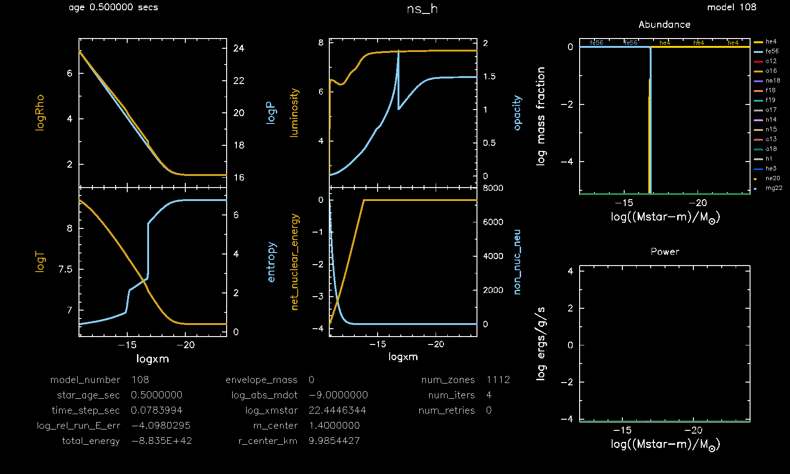
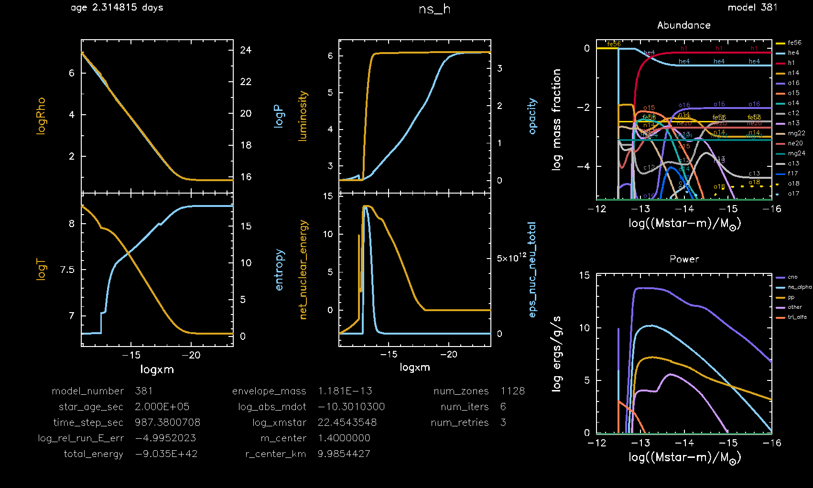

.. _ns_h:

****
ns_h
****

This test case shows an example of steady hydrogen burning within a neutron star envelope.

This test case has 2 parts. Click to see a larger version of a plot.

* Part 1 (``inlist_add_he_layer``) first loads a prebuilt neutron star envelope model ``ns_env.mod``, see the :ref:`make_env` test case. Helium is then accreted at a rate of 1e-9 Msun/year for 0.5 seconds to create a thin helium layer:

* Part 2 (``inlist_to_steady_h_burn``) continues the evolution by accreting a hydrogen-rich solar mixture at a rate of 1e-11 Msun/year. Hydrogen burning eventually reaches a steady location, ``logxm`` = log10((Mstar - m) / Msun) = -12.8, within the neutron star envelope after 2e5 seconds of evolution:

pgstar commands used for the plot above:

.. code-block:: console

 &pgstar

  file_white_on_black_flag = .true. ! white_on_black flags -- true means white foreground color on black background
  !file_device = 'png'            ! png
  !file_extension = 'png'

  file_device = 'vcps'          ! postscript
  file_extension = 'ps'

  pgstar_interval = 10

  pgstar_grid_title_disp = 1.8

  Abundance_xaxis_name = 'logxm' 
  Abundance_xaxis_reversed = .true.
  Abundance_xmin = -16.0
  Abundance_xmax = -12.0

  Power_xaxis_name = 'logxm'
  Power_xaxis_reversed = .true
  Power_xmin = -16.0
  Power_xmax = -12.0

  Profile_Panels1_title = ''
  Profile_Panels1_num_panels = 2

  Profile_Panels1_xaxis_name = 'logxm'
  Profile_Panels1_xaxis_reversed = .true.
  Profile_Panels1_xmin = -101d0
  Profile_Panels1_xmax = -101d0

  Profile_Panels1_yaxis_name(1) = 'logRho'
  Profile_Panels1_yaxis_name(2) = 'logT'
  Profile_Panels1_ymin(1) = -101

  Profile_Panels1_other_yaxis_name(1) = 'logP'
  Profile_Panels1_other_yaxis_name(2) = 'entropy'
  Profile_Panels1_other_ymin(1) = -101

  Profile_Panels2_title = ''
  Profile_Panels2_num_panels = 2

  Profile_Panels2_xaxis_name = 'logxm'
  Profile_Panels2_xaxis_reversed = .true.
  Profile_Panels2_xmin = -101d0
  Profile_Panels2_xmax = -101d0

  Profile_Panels2_yaxis_name(1) = 'luminosity'
  Profile_Panels2_yaxis_name(2) = 'net_nuclear_energy'
  Profile_Panels2_ymin(1) = -101
  Profile_Panels2_ymin(2) = -101

  Profile_Panels2_other_yaxis_name(1) = 'opacity'
  Profile_Panels2_other_yaxis_name(2) = 'eps_nuc_neu_total'
  Profile_Panels2_other_ymin(1) = -101
  Profile_Panels2_other_ymin(2) = -101

  Text_Summary1_txt_scale = 5.5

  Text_Summary1_num_rows = 5
  Text_Summary1_num_cols = 3
  Text_Summary1_name(1, 1) = 'model_number'
  Text_Summary1_name(2, 1) = 'star_age_sec'
  Text_Summary1_name(3, 1) = 'time_step_sec'
  Text_Summary1_name(4, 1) = 'log_rel_run_E_err'
  Text_Summary1_name(5, 1) = 'total_energy'
  Text_Summary1_name(1, 2) = 'envelope_mass'
  Text_Summary1_name(2, 2) = 'log_abs_mdot'
  Text_Summary1_name(3, 2) = 'log_xmstar'
  Text_Summary1_name(4, 2) = 'm_center'
  Text_Summary1_name(5, 2) = 'r_center_km'
  Text_Summary1_name(1, 3) = 'num_zones'
  Text_Summary1_name(2, 3) = 'num_iters'
  Text_Summary1_name(3, 3) = 'num_retries'
  Text_Summary1_name(4, 3) = ' '
  Text_Summary1_name(5, 3) = ' '

  Grid2_title = 'ns_h'
  Grid2_plot_name(1) = 'Profile_Panels1'
  Grid2_plot_name(2) = 'Text_Summary1'
  Grid2_plot_name(3) = 'Abundance'
  Grid2_plot_name(4) = 'Power'
  Grid2_plot_name(5) = 'Profile_Panels2'
  Grid2_plot_row(1) = 1
  Grid2_plot_row(2) = 7
  Grid2_plot_row(3) = 1
  Grid2_plot_row(4) = 5
  Grid2_plot_row(5) = 1
  Grid2_plot_rowspan(1) = 6
  Grid2_plot_rowspan(2) = 2
  Grid2_plot_rowspan(3) = 4
  Grid2_plot_rowspan(4) = 4
  Grid2_plot_rowspan(5) = 6
  Grid2_plot_col(1) = 1
  Grid2_plot_col(2) = 1
  Grid2_plot_col(3) = 5
  Grid2_plot_col(4) = 5
  Grid2_plot_col(5) = 3
  Grid2_plot_colspan(1) = 2
  Grid2_plot_colspan(2) = 4
  Grid2_plot_colspan(3) = 3
  Grid2_plot_colspan(4) = 3
  Grid2_plot_colspan(5) = 2
  Grid2_plot_pad_left(1) = -0.02
  Grid2_plot_pad_left(2) = -0.08
  Grid2_plot_pad_left(3) = 0.14
  Grid2_plot_pad_left(4) = 0.14
  Grid2_plot_pad_left(5) = 0.06
  Grid2_plot_pad_right(1) = 0.07
  Grid2_plot_pad_right(2) = -0.12
  Grid2_plot_pad_right(3) = 0
  Grid2_plot_pad_right(4) = 0
  Grid2_plot_pad_right(5) = -0.01
  Grid2_plot_pad_top(1) = 0
  Grid2_plot_pad_top(2) = 0.08
  Grid2_plot_pad_top(3) = 0
  Grid2_plot_pad_top(4) = 0.06
  Grid2_plot_pad_top(5) = 0
  Grid2_plot_pad_bot(1) = 0
  Grid2_plot_pad_bot(2) = -0.04
  Grid2_plot_pad_bot(3) = 0.09
  Grid2_plot_pad_bot(4) = 0.03
  Grid2_plot_pad_bot(5) = 0
  Grid2_txt_scale_factor(1) = 0.65
  Grid2_txt_scale_factor(2) = 0.19
  Grid2_txt_scale_factor(3) = 0.65
  Grid2_txt_scale_factor(4) = 0.65
  Grid2_txt_scale_factor(5) = 0.65

  Grid2_num_cols = 7
  Grid2_num_rows = 8
  Grid2_num_plots = 5
  
  Grid2_win_flag = .true.
  Grid2_win_width = 16
  Grid2_win_aspect_ratio = 0.6
  
  Grid2_file_flag = .true.
  Grid2_file_dir = 'pgstar_out' 
  Grid2_file_prefix = 'grid_'
  Grid2_file_interval = 10000
  Grid2_file_width = 20
  Grid2_file_aspect_ratio = -1

 / ! end of pgstar namelist

Last-Updated: 21Jun2021 (MESA e2acbc2) by fxt.
