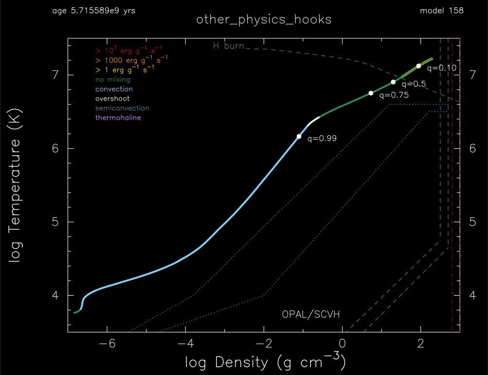

.. _other_physics_hooks:

*******************
other_physics_hooks
*******************

This test case exercises several of the ``other_*`` physics hooks simultaneously in a 1 Msun, Z=0.02 metallicity, model. 
It provides an example of how to include your own physics code into a MESA run.

This test case has 1 part. Click to see a larger version of a plot.

* Part 1 (``inlist_other_physics_hooks_header``) and its signficant ``src`` directory first loads a prebuilt 1 Msun, Z=0.02 metallicity, zero age main sequence model (see ``data/star_data/zams_models/zams_z2m2_y28.data`` for such ZAMS models). A careful examination of the ``run_star_extras.f90`` is warranted and rewarding -- also see the Extending MESA tutorial. The hooks ``other_kap``, ``other_eos``, ``other_screening``, ``overshoot_dbl_exp``, ``other_wind``, ``other_mesh_functions``, and ``other_timestep`` are activated. Some, such as ``other_eos``, simply use the default module. Others, such as ``other_wind``, implement different physics. Some information about their use is reported in the terminal as the model evolves toward its termination when the hydrogen mass fractions drops below 0.25 :

.. code-block:: console

 read inlist_other_physics_hooks
 read_inlist_overshoot_dbl_exp
 read_inlist_other_timestep_limit
 read_inlist_other_winds
 read_inlist_xtrans_mesh_factor

 use Kudritzki wind

 set_other_timestep retry because of timestep limit check_rotation_steps_limit      29

 set_other_timestep retry because of timestep limit check_dlgT_change      31

pgstar commands used for the plot above:

.. code-block:: console

 &pgstar

  file_white_on_black_flag = .true. ! white_on_black flags -- true means white foreground color on black background
  !file_device = 'png'            ! png
  !file_extension = 'png'

  file_device = 'vcps'          ! postscript
  file_extension = 'ps'

  pgstar_interval = 10

 TRho_Profile_win_flag = .true.
 TRho_Profile_win_width = 10
 TRho_Profile_win_aspect_ratio = 0.75 ! aspect_ratio = height/width
         
 TRho_Profile_txt_scale = 1.0
 TRho_Profile_title = 'other_physics_hooks'      
         
 show_TRho_Profile_legend = .true.
 TRho_Profile_legend_coord = 0.07
 TRho_Profile_legend_fjust = 0.0
 TRho_Profile_legend_disp1 = -2.0
 TRho_Profile_legend_del_disp = -1.3

 show_TRho_Profile_eos_regions = .true.
 show_TRho_Profile_burn_lines = .true.
 show_TRho_Profile_burn_labels = .true.
 show_TRho_Profile_degeneracy_line = .false.
 show_TRho_Profile_Pgas_Prad_line = .false.
      
 TRho_Profile_xmin = -7.0
 TRho_Profile_xmax = 3.0
 TRho_Profile_ymin = 3.5
 TRho_Profile_ymax = 7.5        
         
 show_TRho_Profile_mass_locs = .true.
 num_profile_mass_points = 4 

 profile_mass_point_q(1) = 0.10
 profile_mass_point_color_index(1) = 1
 profile_mass_point_symbol(1) = -6
 profile_mass_point_symbol_scale(1) = 1.0
 profile_mass_point_str(1) = '  q=0.10'
 profile_mass_point_str_clr(1) = 1
 profile_mass_point_str_scale(1) = 0.8
         
 profile_mass_point_q(2) = 0.5
 profile_mass_point_color_index(2) = 1
 profile_mass_point_symbol(2) = -6
 profile_mass_point_symbol_scale(2) = 1.0
 profile_mass_point_str(2) = '  q=0.5'
 profile_mass_point_str_clr(2) = 1
 profile_mass_point_str_scale(2) = 0.8
         
 profile_mass_point_q(3) = 0.75
 profile_mass_point_color_index(3) = 1
 profile_mass_point_symbol(3) = -6
 profile_mass_point_symbol_scale(3) = 1.0
 profile_mass_point_str(3) = '  q=0.75'
 profile_mass_point_str_clr(3) = 1
 profile_mass_point_str_scale(3) = 0.8

 profile_mass_point_q(4) = 0.99
 profile_mass_point_color_index(4) = 1
 profile_mass_point_symbol(4) = -6
 profile_mass_point_symbol_scale(4) = 1.0
 profile_mass_point_str(4) = '  q=0.99'
 profile_mass_point_str_clr(4) = 1
 profile_mass_point_str_scale(4) = 0.8

 TRho_Profile_file_flag = .true.
 TRho_Profile_file_dir = 'pgstar_out'
 TRho_Profile_file_prefix = 'trho_'
 TRho_Profile_file_interval = 10000
 TRho_Profile_file_width = 16 
 TRho_Profile_file_aspect_ratio = -1 

 / ! end of pgstar namelist

Last-Updated: 24Jun2021 (MESA e2acbc2) by fxt.
