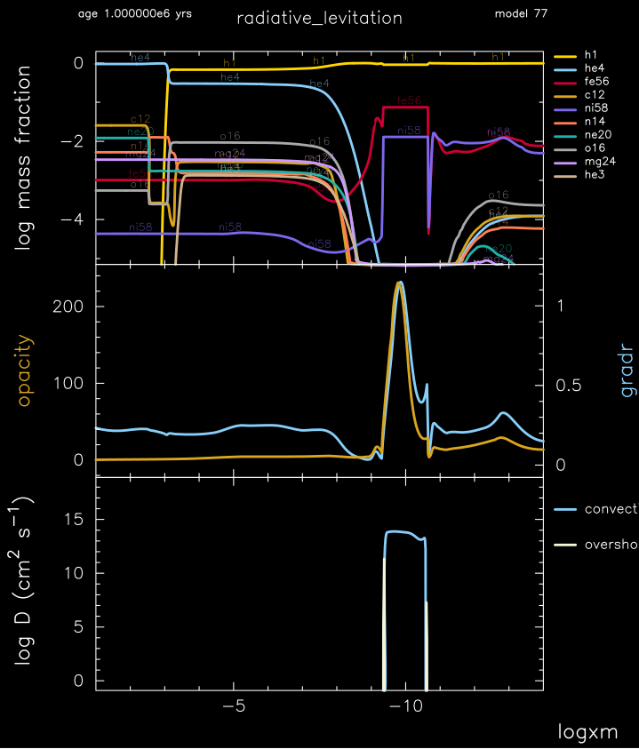

.. _radiative_levitation:

********************
radiative_levitation
********************

This test case exercises radiative levitation and the OP mono opacities in the outer layers of a 0.466 Msun, Z=0.02 metallicity, B-type subdwarf (sdB) model.

This test case has 1 part. Click to see a larger version of a plot.
This test case requires the OP_mono data. See the section ``OP mono opacities`` in ``controls.defaults`` for information on how to obtain this data and set the relevant paths.

* Part 1 (``inlist_radiative_levitation``) loads a pre-built 0.466 Msun, Z=0.02 metallicity, B-type subdwarf (sdB) model, created from :ref:`make_sdb` with an envelope thickness x_ctrl(1) set to 1e-3. Evolution commences with element diffusion activated (``do_element_diffusion = .true.``) and radiative levitation enabled for Fe56 and Ni58 (``diffusion_min_Z_for_radaccel = 26`` and ``diffusion_max_Z_for_radaccel = 28``) for temperatures less than 1e7 K (``diffusion_max_T_for_radaccel = 1e7``). The evolution terminates after 1 million years. The ``run_star_extras.f90`` then checks that at a mass location of 1e-10 Msun that the mass fraction of Fe56 is greater than 0.02, the mass fraction of Ni58 is greater than 0.007, and that their sum is less than 0.8. If so, a success message is written to the terminal:

.. code-block:: console

 found expected effects of radiative levitation

pgstar commands used for the plot above:

.. code-block:: console

 &pgstar

  file_white_on_black_flag = .true. ! white_on_black flags -- true means white foreground color on black background
  !file_device = 'png'            ! png
  !file_extension = 'png'

  file_device = 'vcps'          ! postscript
  file_extension = 'ps'

  pgstar_interval = 10

         Profile_Panels3_win_flag = .true. 
         Profile_Panels3_win_width = 10
         Profile_Panels3_title = 'radiative_levitation'

         Profile_Panels3_xaxis_name = 'logxm'
         Profile_Panels3_xaxis_reversed = .true.
         Profile_Panels3_xmin = -14 ! only used if /= -101d0
         Profile_Panels3_xmax = -1 ! only used if /= -101d0

         Profile_Panels3_num_panels = 3
         Profile_Panels3_yaxis_name(2) = 'opacity'
         Profile_Panels3_other_yaxis_name(2) = 'gradr'

         Profile_Panels3_file_flag = .true. 
         Profile_Panels3_file_dir = 'pgstar_out'
         Profile_Panels3_file_prefix = 'profile_'
         Profile_Panels3_file_interval = 10000
         Profile_Panels3_file_width = 10
         Profile_Panels3_file_aspect_ratio = -1 

 / ! end of pgstar namelist

Last-Updated: 24Jun2021 (MESA e2acbc2) by fxt.
