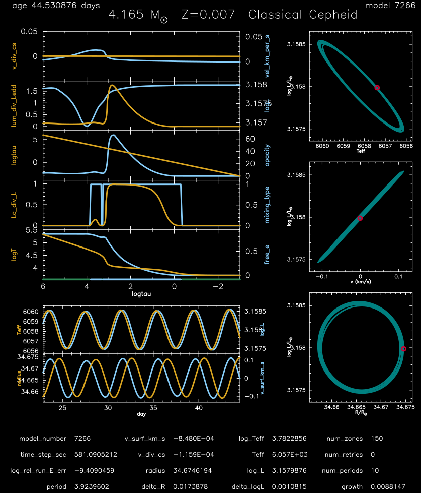

.. _rsp_Cepheid:

***********
rsp_Cepheid
***********

This test case checks the non-linear pulsation evolution of a 4.165 Msun, Teff = 6050 K, L = 1438.8 Lsun, Z = 0.007 metallicity model - a classical Cepheid variable similar to CEP-227 shown in |Pilecki2013|.

This test case has 1 part. Click to see a larger version of a plot.

* Part 1 (``inlist_rsp_Cepheid``) creates the initial 4.165 Msun, Teff = 6050 K, L = 1438.8 Lsun, Z = 0.007 metallicity model, and writes the results of conducting a linear nonadiabatic stability analysis to the LOGS directory (see Section 2.2 of |MESA V| for details). The evolution with RSP then begins. After 10 periods, the ``run_star_extras.f90`` checks if the energy conservation is less than 1e-5 and if fundamental period is within 1% of the expected 3.92305 day period. If these values are within bounds, then a message is written to the terminal and the run terminates:

.. code-block:: console

  rel_run_E_err   3.8990079261471820E-010
  good match for period   3.9239601593741478        3.9230499999999999  

pgstar commands, in addition to those in ``inlist_rsp_pgstar_default``, used for the plot above:

.. code-block:: console

 &pgstar

  file_white_on_black_flag = .true. ! white_on_black flags -- true means white foreground color on black background
  !file_device = 'png'            ! png
  !file_extension = 'png'

  file_device = 'vcps'          ! postscript
  file_extension = 'ps'

  pgstar_interval = 100

      pgstar_age_scale = 0.8
      pgstar_age_lw = 3
      pgstar_age_disp = 3.9
      pgstar_age_coord = -0.11
      pgstar_age_fjust = 0.0

      pgstar_model_disp = 3.9

      History_Panels2_txt_scale = 0.7
      Profile_Panels2_txt_scale = 0.6
      logL_R_txt_scale = 0.7
      logL_v_txt_scale = 0.7
      logL_Teff_txt_scale = 0.7

       Grid2_win_flag = .true.
       Grid2_win_width = 12
       Grid2_title = '4.165 M\d\(2281)\u  Z=0.007  Classical Cepheid'
       Grid2_txt_scale_factor(:) = 1.0

        Grid2_file_flag = .true.
        Grid2_file_dir = 'pgstar_out'
        Grid2_file_prefix = 'grid_'
        Grid2_file_interval = 10000
        Grid2_file_width = -1
        Grid2_file_aspect_ratio = -1

 / ! end of pgstar namelist

.. |Pilecki2013| replace:: `Pilecki et al (2013) <https://ui.adsabs.harvard.edu/abs/2013MNRAS.436..953P/abstract>`__

Last-Updated: 25Jun2021 (MESA e2acbc2) by fxt.
