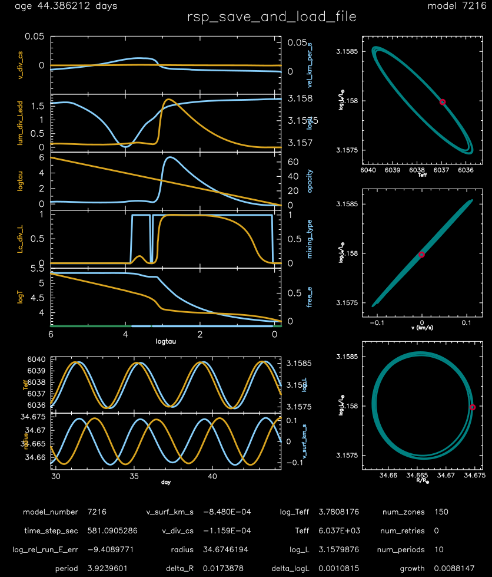

.. _rsp_save_and_load_file:

**********************
rsp_save_and_load_file
**********************

This test case checks that RSP models can be saved and loaded to produce the same results as test case :ref:`rsp_Cepheid`.

This test case has 2 parts. Click to see a larger version of a plot.

* Part 1 (``inlist_rsp_save_file``) follows :ref:`rsp_Cepheid` by creating the initial 4.165 Msun, Teff = 6050 K, L = 1438.8 Lsun, Z = 0.007 metallicity model, and writes the results of conducting a linear nonadiabatic stability analysis to the LOGS directory (see Section 2.2 of |MESA V| for details). The evolution with RSP then begins, terminates after 50 time steps, and writes the file ``test_loading.mod``.

* Part 2 (``inlist_rsp_load_file``) loads the saved file ``test_loading.mod`` and continues the evolution. After 10 periods, the ``run_star_extras.f90`` checks if the energy conservation is less than 1e-5 and if fundamental period is within 1% of the expected 3.92396 day period. If these values are within bounds, then a message is written to the terminal and the run terminates:

.. code-block:: console

 rel_run_E_err   3.8996254433032474E-010
 good match for period   3.9239601147325960        3.9239600000000001 

pgstar commands, in addition to those in ``inlist_rsp_common`` and modifcations to ``how_many_extra_history_columns`` and 
``data_for_extra_history_columns`` in the ``run_star_extras.f90``, used for the plot above:

.. code-block:: console

 &pgstar

  file_white_on_black_flag = .true. ! white_on_black flags -- true means white foreground color on black background
  !file_device = 'png'            ! png
  !file_extension = 'png'

  file_device = 'vcps'          ! postscript
  file_extension = 'ps'

  pgstar_interval = 100

      pgstar_age_scale = 0.8
      pgstar_age_lw = 3
      pgstar_age_disp = 3.9
      pgstar_age_coord = -0.11
      pgstar_age_fjust = 0.0

      pgstar_model_disp = 3.9

      History_Panels2_txt_scale = 0.7
      Profile_Panels2_txt_scale = 0.6
      logL_R_txt_scale = 0.7
      logL_v_txt_scale = 0.7
      logL_Teff_txt_scale = 0.7

       Grid2_win_flag = .true.
       Grid2_win_width = 12
       Grid2_title = 'rsp_save_and_load_file'
       Grid2_txt_scale_factor(:) = 1.0

        Grid2_file_flag = .true.
        Grid2_file_dir = 'pgstar_out'
        Grid2_file_prefix = 'grid_'
        Grid2_file_interval = 10000
        Grid2_file_width = -1
        Grid2_file_aspect_ratio = -1

 / ! end of pgstar namelist

Last-Updated: 01Jul2021 (MESA 094ff71) by fxt.
