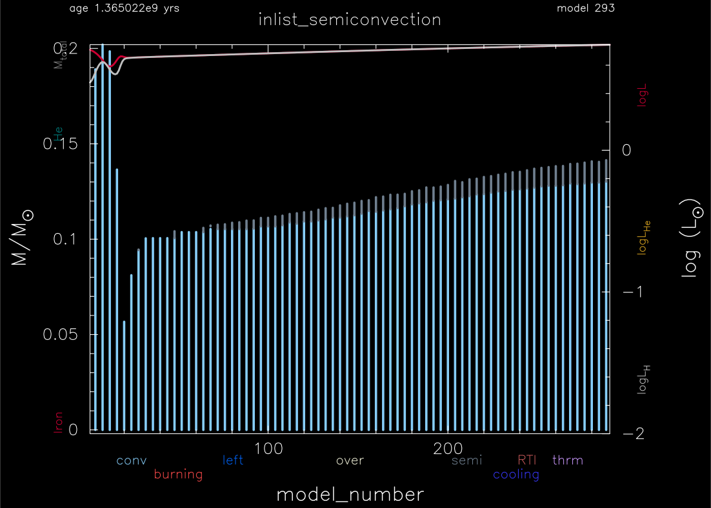

.. _semiconvection:

**************
semiconvection
**************

This test case checks placement of the convective and semiconvective boundaries when using the Ledoux criterion and predictive mixing,
see |MESA V|. The test vehicle is with a 1.5 Msun, Z=0.02 metallicity, model.

This test case has 1 part. Click to see a larger version of a plot.

* Part 1 (``inlist_semiconvection``) loads a pre-built 1.5 Msun, Z=0.02 metallicity, model from test case :ref:`make_zams_high_mass`. New initial model generation should use the supplied ``inlist_to_ZAMS``. The model is then evolved until the central hydrogen mass fraction drops below 0.4. At this time the convective core has almost reached its maximum mass extension, and there is a semiconvective layer above the convective core. The ``run_star_extars.f90`` then checks the mixing types at three points (0.12, 0.135, and 0.15 Msun), where the convective types  should be convection, semiconvection, and no mixing. In addition, the ``run_star_extars.f90`` checks the average temperature and density between two points in the star : 

.. code-block:: console

                 runtime (minutes), retries, steps        3.84         0       293

                              mixing type at 0.125 Msun    1.0000000000000000D+00    1.0000000000000000D+00    1.0000000000000000D+00
                              mixing type at 0.135 Msun    3.0000000000000000D+00    3.0000000000000000D+00    3.0000000000000000D+00
                              mixing type at 0.145 Msun    0.0000000000000000D+00    0.0000000000000000D+00    0.0000000000000000D+00
                                                   logT    7.2064593252093898D+00    7.1500000000000004D+00    7.3099999999999996D+00
                                                 logRho    1.7885667307278197D+00    1.7500000000000000D+00    1.8000000000000000D+00

   all values are within tolerances

Note that the choice made for the inital mixture (a09 in this test
case) and for the nuclear reaction network (here:
pp_and_cno_extras.net) influence the growth of the convective
core. The values used in this test case for the
predictive_superad_thresh parameters work well here but need to be
adjusted when using other mixtures or nuclear reaction networks. 
See the two pdf plots in the ``docs`` directory. Also
note that for speed purposes the values used here for the maximum
allowed timestep and the mesh size do not produce completely converged
models. A convergence study should be done when using this inlist for
science purposes.

pgstar commands used for the plot above:

.. code-block:: console

 &pgstar

  file_white_on_black_flag = .true. ! white_on_black flags -- true means white foreground color on black background
  !file_device = 'png'            ! png
  !file_extension = 'png'

  file_device = 'vcps'          ! postscript
  file_extension = 'ps'

  pgstar_interval = 10

  Kipp_win_flag = .true.
  Kipp_win_width = 16
  Kipp_win_aspect_ratio = 0.75
  Kipp_txt_scale = 1.0
  Kipp_title = 'inlist_semiconvection'      

  Kipp_mass_max = 0.2
  Kipp_mass_min = 0 
  Kipp_xmax = -101d0
  Kipp_xmin = 0     

  Kipp_show_mixing = .true.
  Kipp_show_burn = .true.
  Kipp_show_luminosities = .true.
  Kipp_show_mass_boundaries = .false.

  Kipp_file_flag = .true.
  Kipp_file_dir = 'pgstar_out'
  Kipp_file_prefix = 'kipp_'
  Kipp_file_interval = 10000
  Kipp_file_width = 16      
  Kipp_file_aspect_ratio = -1 

 / ! end of pgstar namelist

Last-Updated: 01Jul2021 (MESA 094ff71) by fxt, based on documentation from Anne Thoul.
