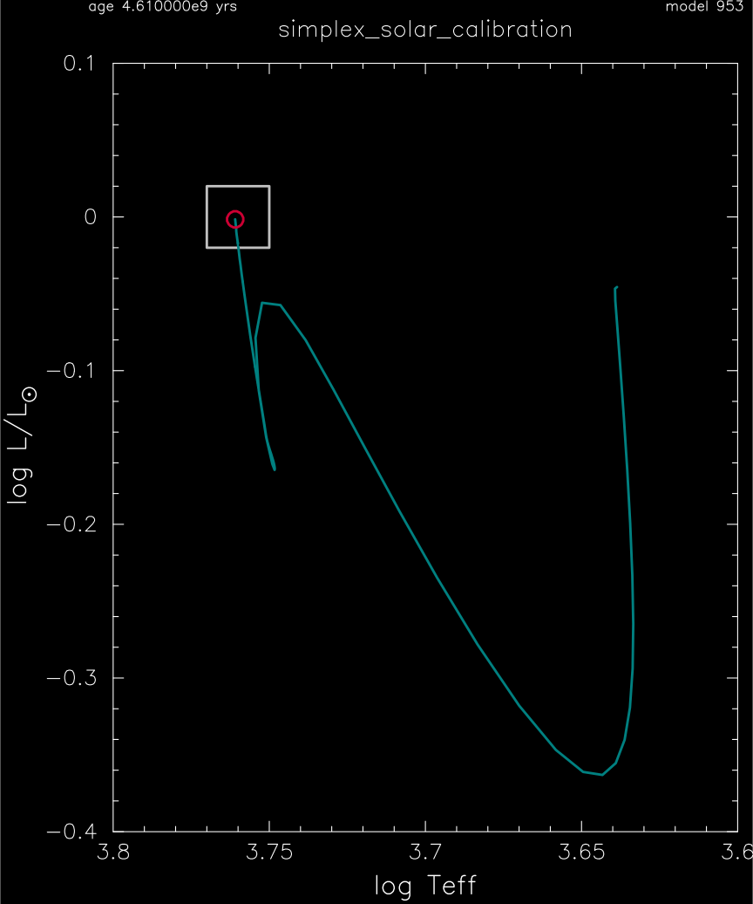

.. _simplex_solar_calibration:

*************************
simplex_solar_calibration
*************************

This test case exercises the simplex framework with a check of the chi^2 value for 1.0 Msun, Z=0.02 metallicity, solar model.

This test case has 2 parts. Click to see a larger version of a plot.

* Part 1 (``inlist_prezams``) builds a 1.0 Msun, Z=0.02 metallicity, model and evolves it for 1 million years.

* Part 2 (``inlist_solar``) continues the evolution until the age reaches 4.61 billion years. Within the simplex modules, a chi^2 value is calculated using target values and controls in ``inlist_simplex_search_controls_solar``. An actual simplex optimzation is performed:

.. code-block:: console

                           logL chi2term        0.0009674439
                                    logL       -0.0015551880
                                logL_obs        0.0000000000
                              logL_sigma        0.0500000000

                surface_Z_div_X chi2term    0.8009079999E+01
                         surface_Z_div_X        0.0257500318
                     surface_Z_div_X_obs        0.0229200000
                   surface_Z_div_X_sigma        0.0010000000

                     surface_He chi2term        1.5892649664
                              surface_He        0.2529123118
                          surface_He_obs        0.2485000000
                        surface_He_sigma        0.0035000000

                            Rcz chi2term        6.3978145880
                                     Rcz        0.7155293902
                                 Rcz_obs        0.7130000000
                               Rcz_sigma        0.0010000000

                   solar_cs_rms chi2term       16.1837119538
                            solar_cs_rms        0.0008045797
                        solar_cs_rms_obs        0.0000000000
                      solar_cs_rms_sigma        0.0002000000

                        my_Teff chi2term        0.0068963316
                                 my_Teff     5766.6021299392
                             my_Teff_obs     5772.0000000000
                           my_Teff_sigma       65.0000000000

                                  R/Rsun        1.0000819542
                               logL/Lsun       -0.0015551880
                                    Teff     5766.6021299392
                                    logg        4.4379964457
                                     FeH        0.0503737150
                                    logR        0.0000355908
                         surface_Z_div_X        0.0257500318
                              surface_He        0.2529123118
                                     Rcz        0.7155293902
                            solar_cs_rms        0.0008045797

                              initial h1        0.7032295134
                             initial he3        0.0000276601
                             initial he4        0.2765734428
                               initial Y        0.2766011029
                               initial Z        0.0201693837
                             initial FeH        0.0971914841

                               mass/Msun        1.0000000000
                                   alpha        1.9328813396
                                    f_ov        0.0319201826
                                     age    4.6100000000000000D+09

                                   chi^2        5.3646225472

                            model number             953

 save best model results to outputs/sample_0001.data

pgstar commands used for the plot above:

.. code-block:: console

 &pgstar

  file_white_on_black_flag = .true. ! white_on_black flags -- true means white foreground color on black background
  !file_device = 'png'            ! png
  !file_extension = 'png'

  file_device = 'vcps'          ! postscript
  file_extension = 'ps'

  pgstar_interval = 10

  HR_win_flag = .true.
  HR_win_width = 12
  HR_win_aspect_ratio = 1.2 ! aspect_ratio = height/width

  HR_logT_min = 3.6
  HR_logT_max = 3.8
  HR_logL_min = -0.4
  HR_logL_max = 0.1

  show_HR_target_box = .true.
  HR_target_n_sigma = -1
  HR_target_logL = 0.0
  HR_target_logL_sigma = 0.02
  HR_target_logT = 3.76
  HR_target_logT_sigma = 0.01

  HR_file_flag = .true.
  HR_file_dir = 'pgstar_out'
  HR_file_prefix = 'hr'
  HR_file_interval = 10000 
  HR_file_width = 12
  HR_file_aspect_ratio = -1 

 / ! end of pgstar namelist

Last-Updated: 03Jul2021 (MESA 094ff71) by fxt.
