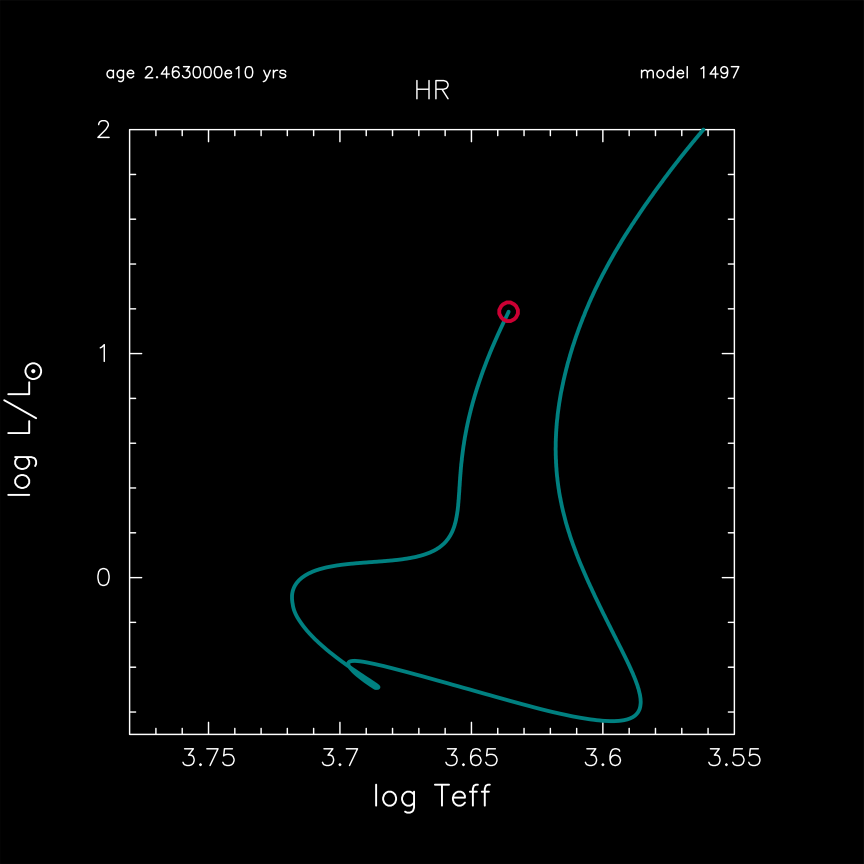

.. _starspots:

******************
starspots
******************

This test suite case evolves a 0.9 |Msun|, solar metallicity (Z=0.02) model
to an age of 24.63 Gyr using MESA's implementation of the
YREC (Yale Rotating Evolution Code) SPOTS formalism introduced by
`Somers et al. (2020; ApJ) <https://ui.adsabs.harvard.edu/abs/2015ApJ...807..174S>`__
Compare to Figure 15 in Section 7 of MESA Instrument Paper VI.

The impedance of the surface flux due to magnetic pressure from starspots is parameterized
in the style of an atmospheric boundary modification. As first described by
`Somers et al. (2015; ApJ) <https://ui.adsabs.harvard.edu/abs/2015ApJ...807..174S>`__,
the degree of "spottiness" on the stellar surface is characterized using two parameters:

* SPOTF (hereafter ``fspot``): a coverage fraction, or "spot filling factor" (in the notation of the YREC documentation); and

* SPOTX (hereafter ``xspot``): the temperature contrast between the spotted and unspotted regions: xspot = T_spot/T_photosphere.

The coverage fraction is set to ``fspot = 0.34``
(for consistency with observations of low-mass stars:
`Cao et al., 2022 <https://ui.adsabs.harvard.edu/abs/2022ApJ...924...84C>`__)
and the temperature contrast is set to ``xspot = 0.85`` (also from fits to observations).

Detailed discussion of this functionality can be found in
`MESA Instrument Paper VI: Starspots <https://ui.adsabs.harvard.edu/abs/2023ApJS..265...15J>`__.

A plot of the HR diagram for the problem is included below:

Last-Updated: 09Aug2024 by Meridith Joyce

Last-Run: 22Oct2024 (MESA 9b2017ca) by pmocz on C916PXT6XW in 656 seconds using 8 threads.
