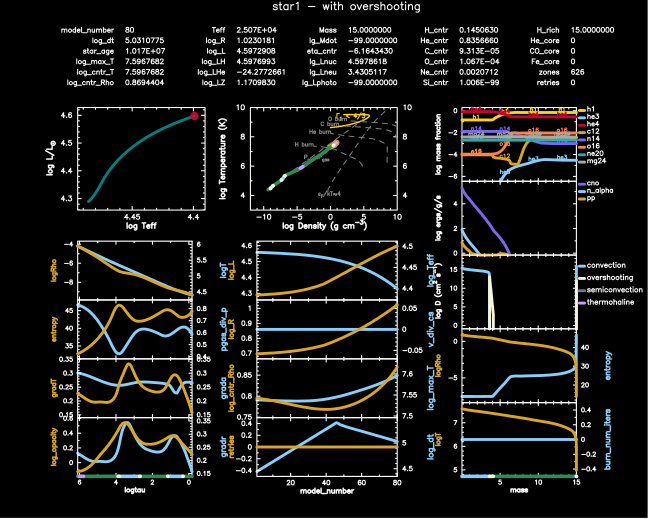
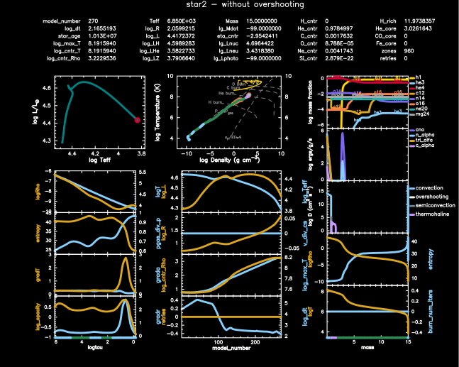

.. _twin_studies:

************
twin_studies
************

This test case exercise the capability to simultaneously evolve two model stars.
The test vehicle is a pair of 15 Msun, Z=0.02 metallicity, models one with overshooting and one without overshooting.

``inlist_multi_stars_job`` and the ``run_star_extras.f90`` control the overall flow. 
For star 1, ``inlist_to_end_core_he_burn_header``, ``inlist_common``, ``inlist_mass_Z_wind_rotation``, ``inlist_to_end_core_he_burn``
and ``inlist_star1`` are read. The same is done for star 2, but with ``inlist_star2`` which turns off overshooting being read.
A pre-built 15 Msun, Z=0.02 metallicity, is then loaded for each model. Both models evolve simultaneouly for 1.013e7 year.

Star 1, with overshooting, reaches the ending age in 80 steps:

|br| |br|
Star 2, without overshooting, reaches the ending age in 273 steps. Star 2 is further along
in its evolutionary path as might be expected without the extra fuel provided to the 
core by overshooting:

pgstar commands, in addition to those in ``inlist_pgstar`` used for the plots above
for star 1:

.. code-block:: console

 &pgstar

   pgstar_interval = 1

   Grid1_title = 'star1 - with overshooting'
  
   file_white_on_black_flag = .true. ! white_on_black flags -- true means white foreground color on black background
   !file_device = 'png'            ! png
   !file_extension = 'png'

   file_device = 'vcps'          ! postscript
   file_extension = 'ps'

   Grid1_file_flag = .true.
   Grid1_file_dir = 'png1'
   Grid1_file_prefix = 'star1'
   Grid1_file_interval = 10

 / ! end of pgstar namelist

|br| 
and for star 2:

.. code-block:: console

 &pgstar

   pgstar_interval = 1

   file_white_on_black_flag = .true. ! white_on_black flags -- true means white foreground color on black background
   !file_device = 'png'            ! png
   !file_extension = 'png'

   file_device = 'vcps'          ! postscript
   file_extension = 'ps'

   Grid1_title = 'star2 - without overshooting'
   
   Grid1_file_flag = .true.
   Grid1_file_dir = 'png2'
   Grid1_file_prefix = 'star2'
   Grid1_file_interval = 10

 / ! end of pgstar namelist

Last-Updated: 01Jul2021 (MESA 094ff71) by fxt.

.. # define a hard line break for HTML
.. |br| raw:: html

       
