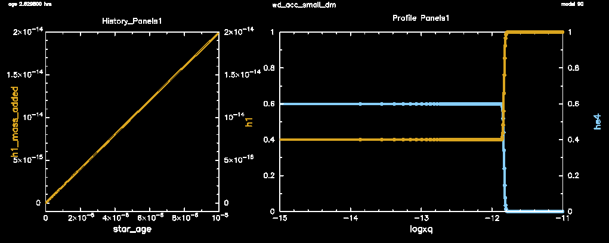

This test checks accretion in MESA with small timesteps, such that the
mass added in the step is similar to the mass of the outer zone.  The
accreted material has a different composition (H/He mixture) than the
initial composition of the WD surface (pure H).

The original version of this test was written by Dean Townsley.  It
was motivated by the fact that in r8845 (and earlier), if material
being added is not the same abundance as the surface, the individual
species accretion rates were wrong and the composition profiles did
not monotonically transition from the accreted composition to the
initial surface composition.

During the test, the mass of accreted H is checked at every step.  At
the end of the test, the final profile is checked to see if the
abundances match the accretion composition in the accreted layer and
the initial surface abundance below this layer.  A passing result
shows the expected linear increase in accreted mass with time and an
artifact-free transition between the accreted composition and the
initial surface composition.

Last-Updated: 2020-07-22 (mesa r14248) by Josiah Schwab

