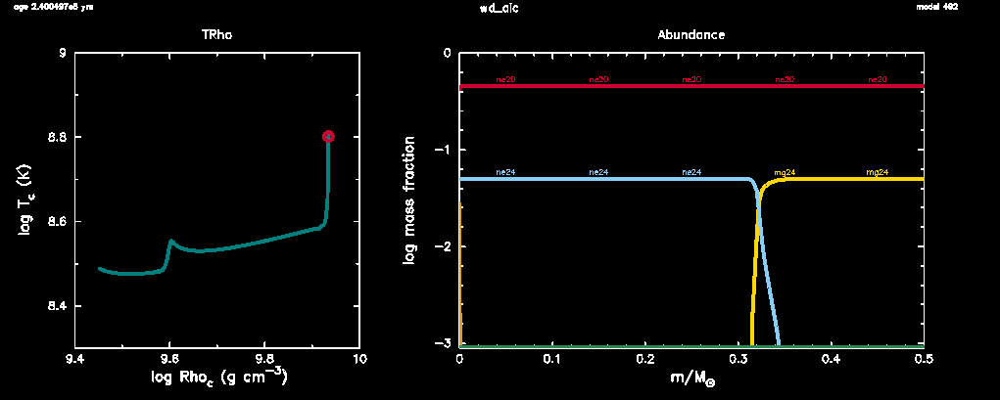

.. _wd_aic:

******
wd_aic
******

This test case evolves an accreting ONeMg WD up to the point of
thermal runaway in the core (see |Schwab2015|).

It exercises the special weak rate implementation detailed in that
paper and in Section 8 of |MESA III|.  These capabilities are
activated via the options

.. literalinclude:: ../../../star/test_suite/wd_aic/inlist_wd_aic
   :start-after: new_cumulative_energy_error
   :end-before: change_conv_vel_flag

This computes the key reaction rates (electron capture on 24Mg and
20Ne) on-the-fly from nuclear data specified in the indicated input
files.  This is significantly more costly than using tabulated rates,
so in many applications tabulated rates for these reactions should be
preferred (see ``use_suzuki_weak_rates``).  However, these on-the-fly
rates are more accurate at low temperatures (below 1e8 K) and allow
explicit updating of nuclear physics.

The density-driven weak reactions that occur in this example mean that
the composition (and electron fraction) deep in the degenerate WD
interior change.  It is critical that composition changes be included
in the energy equation via::

    include_composition_in_eps_grav = .true.

Similarly, it is critical to use the Ledoux criterion::

    use_Ledoux_criterion = .true.

so that the stabilizing effects of the composition gradient is
included.
    
The test succeeds if the 20Ne electron captures cause a temperature
spike at the center of the model.

.. |Schwab2015| replace:: `Schwab et al. 2015 <https://ui.adsabs.harvard.edu/abs/2015MNRAS.453.1910S/abstract>`__

Last-Updated: 2020-10-30 (mesa r14735) by Josiah Schwab

