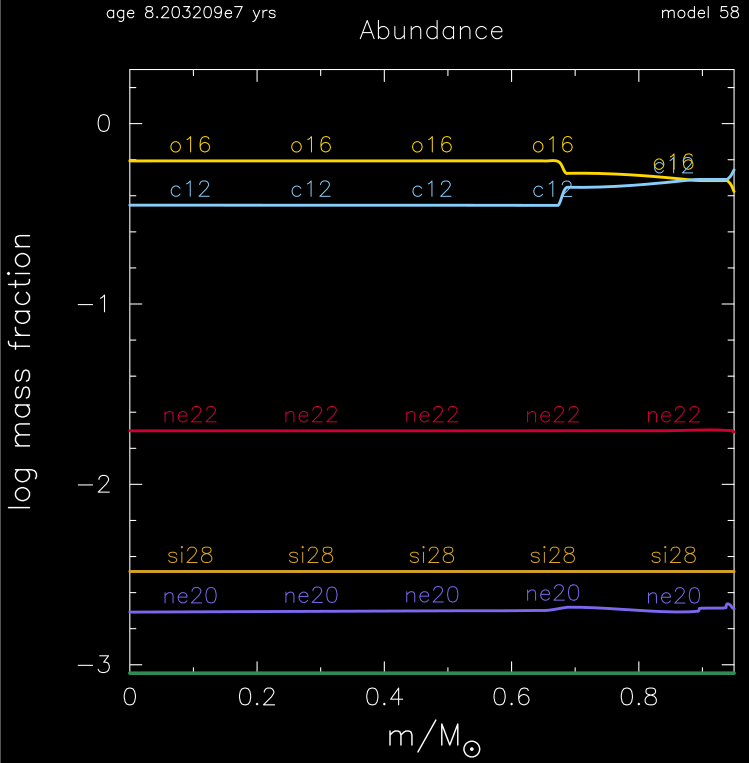
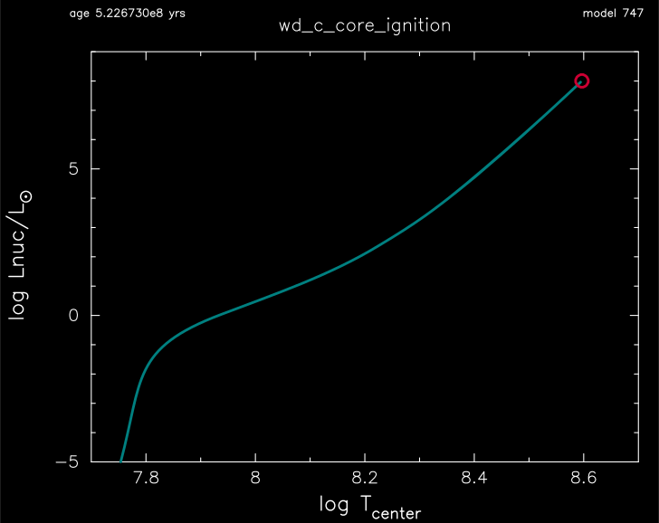
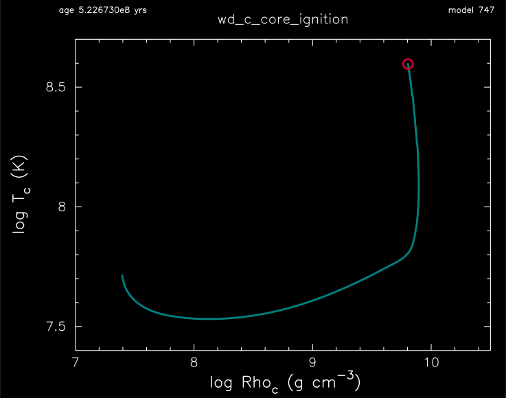
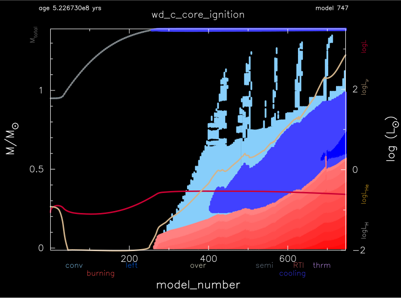

.. _wd_c_core_ignition:

******************
wd_c_core_ignition
******************

This test case the checks the onset of a thermonuclear runaway in an accreting Chandrasekhar mass carobon-oxygen white dwarf.

This test case has 2 parts. Click to see a larger version of a plot.

* Part 1 (``inlist_relax_mass``) loads ``make_co_wd_6M.mod``, a 0.9577 Msun carbon-oxygen white dwarf model with a helium atmosphere, made from a 6 Msun ZAMS progenitor with :ref:`make_co_wd`. The outer helium layer is then removed to leave a 0.9497 Msun carbon-oxygen white dwarf and the run terminates:

* Part 2 (``inlist_wd_c_core_ignition``) continues the evolution by accreting a carbon-oxygen miture with the same mass fractions as the surface at a rate of 1e-9 Msun/yr. As the white dwarf mass nears the Chandrasekhar mass, carbon burning causes the interior to become convective (the simmering phase of standard paradign Type Ia supernova). The run terminates when the power generated by nuclear reactions exceeds 1e8 Lsun:

|br| 
Central density and temperature evolution:

|br| 
Convective and burn history

|br|
pgstar commands used for the Part 1 plot above:

.. code-block:: console

 &pgstar
  file_white_on_black_flag = .true. ! white_on_black flags -- true means white foreground color on black background
  !file_device = 'png'            ! png
  !file_extension = 'png'

  file_device = 'vcps'          ! postscript
  file_extension = 'ps'

     Abundance_win_flag = .true.
     Abundance_win_width = 12
     Abundance_win_aspect_ratio = 1 ! aspect_ratio = height/width

     Abundance_xaxis_name = 'mass'
     Abundance_xmin = 0 
     Abundance_xmin = -101d0

     Abundance_line_txt_scale_factor = 1.1 ! relative to other text
     Abundance_legend_txt_scale_factor = 1.1 ! relative to other text
     Abundance_legend_max_cnt = 0
     Abundance_log_mass_frac_min = -3 ! only used if < 0

     Abundance_file_flag = .true.
     Abundance_file_dir = 'pgstar_out'
     Abundance_file_prefix = 'abund_'
     Abundance_file_interval = 10000
     Abundance_file_width = -1 
     Abundance_file_aspect_ratio = -1 

 / ! end of pgstar namelist

|br|
pgstar commands used for the Part 2 plots above:

.. code-block:: console

 &pgstar

  file_white_on_black_flag = .true. ! white_on_black flags -- true means white foreground color on black background
  !file_device = 'png'            ! png
  !file_extension = 'png'

  file_device = 'vcps'          ! postscript
  file_extension = 'ps'

     TRho_win_flag = .true.
     TRho_win_width = 12
     TRho_win_aspect_ratio = 0.75 ! aspect_ratio = height/width
     TRho_title = 'wd_c_core_ignition'      

     TRho_logT_min = 7.4 
     TRho_logT_max = 8.7 
     TRho_logRho_min = 7.0 
     TRho_logRho_max = 10.5 
     show_TRho_degeneracy_line = .true.

     TRho_file_flag = .true.
     TRho_file_dir = 'pgstar_out'
     TRho_file_prefix = 'trhoc_'
     TRho_file_interval = 10000
     TRho_file_width = -1 
     TRho_file_aspect_ratio = -1 

     History_Track1_win_flag = .true.
     History_Track1_win_width = 12
     History_Track1_win_aspect_ratio = 0.75
     History_Track1_title = 'wd_c_core_ignition'

     History_Track1_xname = 'log_center_T'
     History_Track1_yname = 'log_Lnuc'
     History_Track1_xaxis_label = 'log T\dcenter'
     History_Track1_yaxis_label = 'log Lnuc/L\d\(2281)'
     History_Track1_reverse_xaxis = .false.
     History_Track1_reverse_yaxis = .false.

     History_Track1_xmin = 7.7
     History_Track1_xmax = 8.7
     History_Track1_ymin = -5.0
     History_Track1_ymax = 9.0

     History_Track1_file_flag = .true.
     History_Track1_file_dir = 'pgstar_out'
     History_Track1_file_prefix = 'track1_'
     History_Track1_file_interval = 10000
     History_Track1_file_width = -1
     History_Track1_file_aspect_ratio = -1

     Kipp_win_flag = .true.
     Kipp_win_width = 12
     Kipp_title = 'wd_c_core_ignition'      
     Kipp_mass_max = -101d0
     Kipp_show_mixing = .true.
     Kipp_show_burn = .true.
     Kipp_show_luminosities = .true.
     Kipp_lgL_max = 3.0
     Kipp_file_flag = .true.
     Kipp_file_dir = 'pgstar_out'
     Kipp_file_prefix = 'kipp_'
     Kipp_file_interval = 10000
     Kipp_file_width = -1 
     Kipp_file_aspect_ratio = -1 

 / ! end of pgstar namelist

Last-Updated: 04Jul2021 (MESA 094ff71) by fxt.

.. # define a hard line break for HTML
.. |br| raw:: html

       
