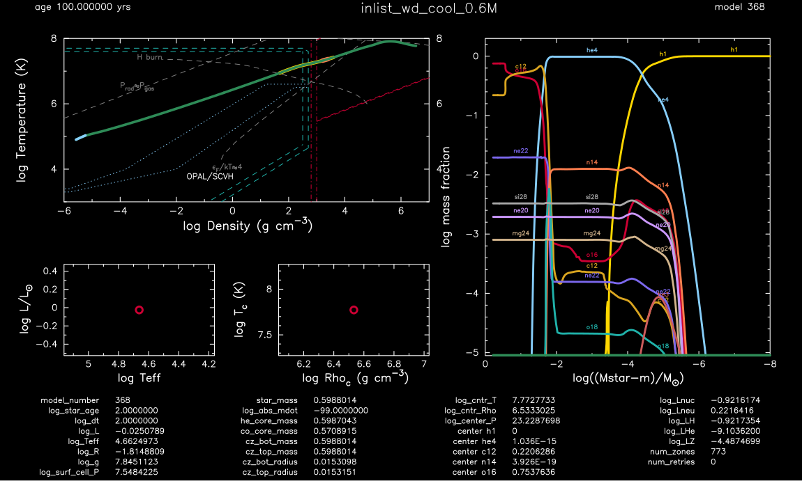
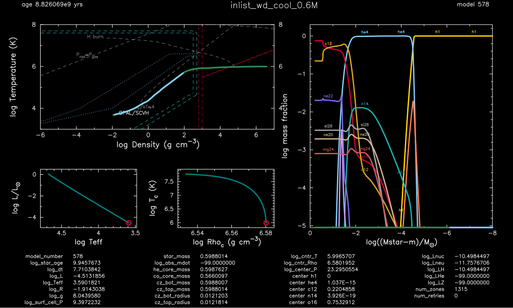

.. _wd_cool_0.6M:

************
wd_cool_0.6M
************

This test case the checks the evolution of a cooling, element diffusing 0.6 Msun white dwarf.

This test case has 1 part. Click to see a larger version of a plot.

* Part 1 (``inlist_relax_mass``) loads ``co_wd_settled.mod``, a 0.596 Msun carbon-oxygen white dwarf model with hydrogen-rich outer layers, produced from ``final.mod`` produced by :ref:`make_co_wd` as of version 14731 :

|br| 
The evolution then commences with element diffusion activated, and the run terminates when the central temperature drops below 1e6 K:

|br|
pgstar commands used for the plots above:

.. code-block:: console

 &pgstar

  file_white_on_black_flag = .true. ! white_on_black flags -- true means white foreground color on black background
  !file_device = 'png'            ! png
  !file_extension = 'png'

  file_device = 'vcps'          ! postscript
  file_extension = 'ps'

         Grid2_win_flag = .true.
         Grid2_win_width = 16
         Grid2_title = 'inlist_wd_cool_0.6M'
         Grid2_xleft = 0.08
         Grid2_xright = 0.99
         Grid2_ybot = 0.04
         Grid2_ytop = 0.92

         Grid2_file_flag = .true.
         Grid2_file_width = 16
         Grid2_file_interval = 10000

         TRho_Profile_xmin = -6.0
         TRho_Profile_xmax = 7.0
         TRho_Profile_ymin = 3.0
         TRho_Profile_ymax = 8.0

         show_TRho_Profile_eos_regions = .true.
         show_TRho_Profile_degeneracy_line = .true.
         show_TRho_Profile_Pgas_Prad_line = .true.
         show_TRho_Profile_burn_lines = .true.
         show_TRho_Profile_burn_labels = .true.
         show_TRho_Profile_text_info = .false.
         TRho_Profile_title =' '

         Abundance_xaxis_name = 'logxm'
         Abundance_xaxis_reversed = .true.
         Abundance_xmin = -8.0
         Abundance_xmax = 0.0
         Abundance_log_mass_frac_min = -5.0
         Abundance_log_mass_frac_max =  0.3
         num_abundance_line_labels = 5
         Abundance_legend_max_cnt = 0
         Abundance_title =' '

         HR_title =' '
         TRho_title =' '

         pgstar_model_coord = 0.96

 / ! end of pgstar namelist

Last-Updated: 05Jul2021 (MESA 094ff71) by fxt.

.. # define a hard line break for HTML
.. |br| raw:: html

       
