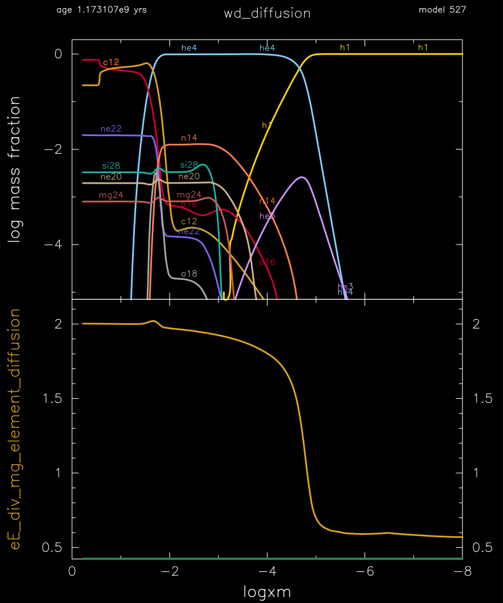

.. _wd_diffusion:

************
wd_diffusion
************

This test case the checks element diffusion in a 0.6 Msun carbon-oxygen white dwarf.

This test case has 1 part. Click to see a larger version of a plot.

* Part 1 (``inlist_wd_diff``) loads ``co_wd_settled.mod``, a 0.596 Msun carbon-oxygen white dwarf model with hydrogen-rich outer layers, produced from ``final.mod`` by :ref:`make_co_wd` as of version 14731. The run terminates when the effective temperatures drops below 9000 K. The ``run_star_extras.f90`` then checks that the electrostatic/gravitational force ratio at the 0.5 Msun point are between 1.95 and 2.05:

.. code-block:: console

 Core eE/mg =    2.0005029376686494     
 passed test for electric field in the core

|br|
pgstar commands used for the plots above:

.. code-block:: console

 &pgstar

  file_white_on_black_flag = .true. ! white_on_black flags -- true means white foreground color on black background
  !file_device = 'png'            ! png
  !file_extension = 'png'

  file_device = 'vcps'          ! postscript
  file_extension = 'ps'

        Profile_Panels2_win_flag = .true.
        Profile_Panels2_win_width = 12
        Profile_Panels2_title = 'wd_diffusion'

        Profile_Panels2_yaxis_name(2) = 'eE_div_mg_element_diffusion'

        Profile_Panels2_xaxis_name = 'logxm'
        Profile_Panels2_xaxis_reversed = .true.
        Profile_Panels2_xmin = -8
        Profile_Panels2_xmax = 0
        Profile_Panels2_show_mix_regions_on_xaxis = .true.

        Profile_Panels2_xright = 0.92
        Profile_Panels2_ytop = 0.92

        num_abundance_line_labels = 5
        Abundance_legend_max_cnt = 0

        Profile_Panels2_file_flag = .true.
        Profile_Panels2_file_dir = 'pgstar_out'
        Profile_Panels2_file_prefix = 'profile_'
        Profile_Panels2_file_interval = 100000     
        Profile_Panels2_file_width = -1
        Profile_Panels2_file_aspect_ratio = -1

 / ! end of pgstar namelist

Last-Updated: 06Jul2021 (MESA 094ff71) by fxt.

.. # define a hard line break for HTML
.. |br| raw:: html

       
