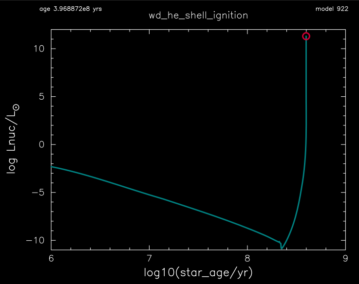
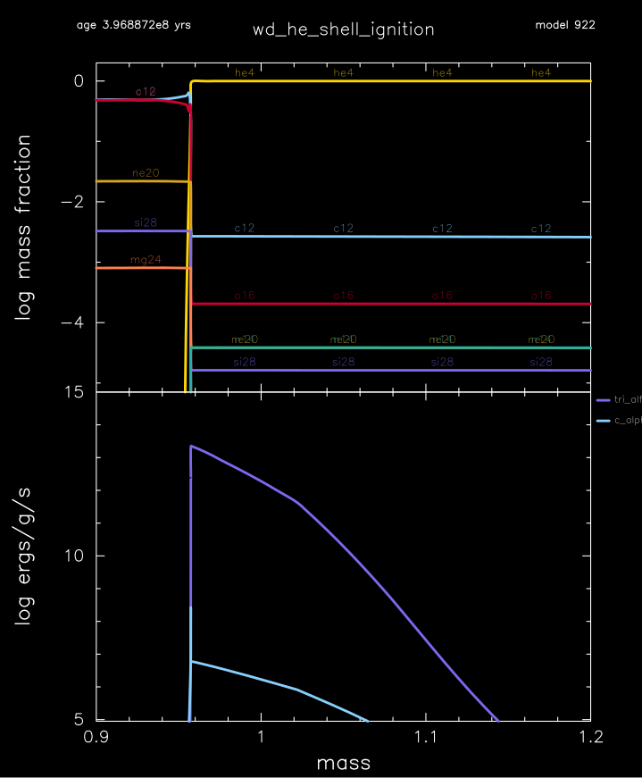
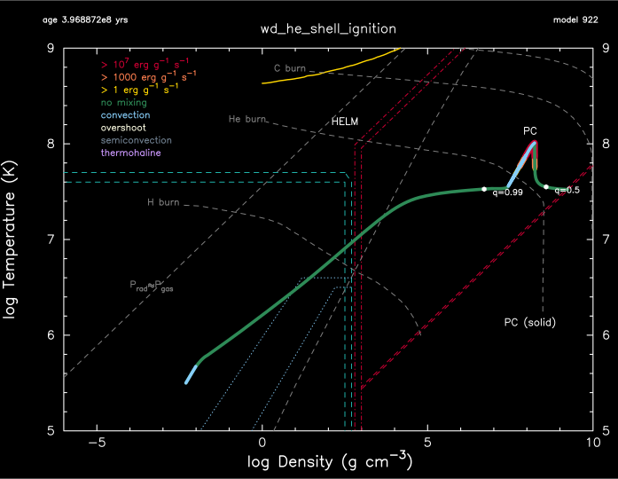

.. _wd_he_shell_ignition:

********************
wd_he_shell_ignition
********************

This test case checks the ignition of a helium layer in an accreting in a 0.96 Msun carbon-oxygen white dwarf model.

This test case has 1 part. Click to see a larger version of a plot.

* Part 1 (``inlist_he_shell_ignition``) loads 'co_wd_0.96M.mod', a 0.96 Msun carbon-oxygen white dwarf with a helium layer and then a hydrogen layer. The model is from a 6 Msun ZAMS progenitor with :ref:`make_co_wd` in r13718.  Pure helum then acceretes onto the hydrogen surface at a rate of 1e-9 Msun/yr. The helium layer ignites as teh total mass approches 1.36 Msun, and the run terminates when the helium burning luminosity first exceeds 1e11 Lsun:

|br|
The initial hydrogen burns as its pushed deeper into the model by accreretion. The initial helium layer and the accreted helium 
thus merge to form a single helium layer. This single helium layer ignites at it is pushed to higher densities and temperatures
by the continued accretion:

|br|
Temperature and desnity profile at ignition:

|br|
pgstar commands used for the plots above:

.. code-block:: console

 &pgstar

  file_white_on_black_flag = .true. ! white_on_black flags -- true means white foreground color on black background
  !file_device = 'png'            ! png
  !file_extension = 'png'

  file_device = 'vcps'          ! postscript
  file_extension = 'ps'

    Profile_Panels2_win_flag = .true.
    Profile_Panels2_win_width = 10
    Profile_Panels2_title = 'wd_he_shell_ignition'

    Profile_Panels2_xaxis_name = 'mass'
    Profile_Panels2_xaxis_reversed = .false.
    Profile_Panels2_xmin = 0.90
    Profile_Panels2_xmax = 1.2
    Profile_Panels2_show_mix_regions_on_xaxis = .false.

    Profile_Panels2_xright = 0.92
    Profile_Panels2_ytop = 0.92

    num_abundance_line_labels = 5
    Abundance_legend_max_cnt = 0

    Profile_Panels2_yaxis_name(2) = 'Power'
    Profile_Panels2_ymin(2) = 5.0
    Profile_Panels2_ymax(2) = 15.0

    Profile_Panels2_file_flag = .true.
    Profile_Panels2_file_dir = 'pgstar_out'
    Profile_Panels2_file_prefix = 'profile_'
    Profile_Panels2_file_interval = 100000     
    Profile_Panels2_file_width = -1
    Profile_Panels2_file_aspect_ratio = -1

    History_Track1_win_flag = .true.
    History_Track1_win_width = 12
    History_Track1_win_aspect_ratio = 0.75
    History_Track1_title = 'wd_he_shell_ignition'

    History_Track1_xname = 'log_star_age'
    History_Track1_yname = 'log_Lnuc'
    History_Track1_xaxis_label = 'log10(star_age/yr)'
    History_Track1_yaxis_label = 'log Lnuc/L\d\(2281)'
    History_Track1_reverse_xaxis = .false.
    History_Track1_reverse_yaxis = .false.

    History_Track1_xmin = 6.0
    History_Track1_xmax = 9.0
    History_Track1_ymin = -11.0
    History_Track1_ymax = 12.0

    History_Track1_file_flag = .true.
    History_Track1_file_dir = 'pgstar_out'
    History_Track1_file_prefix = 'track1_'
    History_Track1_file_interval = 10000
    History_Track1_file_width = -1
    History_Track1_file_aspect_ratio = -1

    TRho_Profile_win_flag = .true.
    TRho_Profile_win_width = 10
    TRho_Profile_win_aspect_ratio = 0.75 ! aspect_ratio = height/width
    TRho_Profile_title = 'wd_he_shell_ignition'      

    TRho_Profile_xmin = -6.0
    TRho_Profile_xmax = 10.0
    TRho_Profile_ymin = 5.0
    TRho_Profile_ymax = 9.0        
         
    TRho_Profile_xleft = 0.10
    TRho_Profile_xright = 0.93
    TRho_Profile_ybot = 0.10
    TRho_Profile_ytop = 0.90
    TRho_Profile_txt_scale = 0.9
         
    show_TRho_Profile_legend = .true.
    TRho_Profile_legend_coord = 0.07
    TRho_Profile_legend_fjust = 0.0
    TRho_Profile_legend_disp1 = -2.0
    TRho_Profile_legend_del_disp = -1.3
    TRho_Profile_legend_txt_scale = 0.9

    show_TRho_Profile_eos_regions = .true.
    show_TRho_Profile_degeneracy_line = .true.
    show_TRho_Profile_Pgas_Prad_line = .true.
    show_TRho_Profile_burn_lines = .true.
    show_TRho_Profile_burn_labels = .true.
      
    show_TRho_Profile_mass_locs = .true.
    num_profile_mass_points = 2 

    profile_mass_point_q(1) = 0.5
    profile_mass_point_color_index(1) = 1
    profile_mass_point_symbol(1) = -6
    profile_mass_point_symbol_scale(1) = 1.0
    profile_mass_point_str(1) = '  q=0.5'
    profile_mass_point_str_clr(1) = 1
    profile_mass_point_str_scale(1) = 0.8
         
    profile_mass_point_q(2) = 0.99
    profile_mass_point_color_index(2) = 1
    profile_mass_point_symbol(2) = -6
    profile_mass_point_symbol_scale(2) = 1.0
    profile_mass_point_str(2) = '  q=0.99'
    profile_mass_point_str_clr(2) = 1
    profile_mass_point_str_scale(2) = 0.8
         
    TRho_Profile_file_flag = .true.
    TRho_Profile_file_dir = 'pgstar_out'
    TRho_Profile_file_prefix = 'trho_'
    TRho_Profile_file_interval = 10000
    TRho_Profile_file_width = -1 
    TRho_Profile_file_aspect_ratio = -1 

 / ! end of pgstar namelist

Last-Updated: 07Jul2021 (MESA 094ff71) by fxt.

.. # define a hard line break for HTML
.. |br| raw:: html

       
