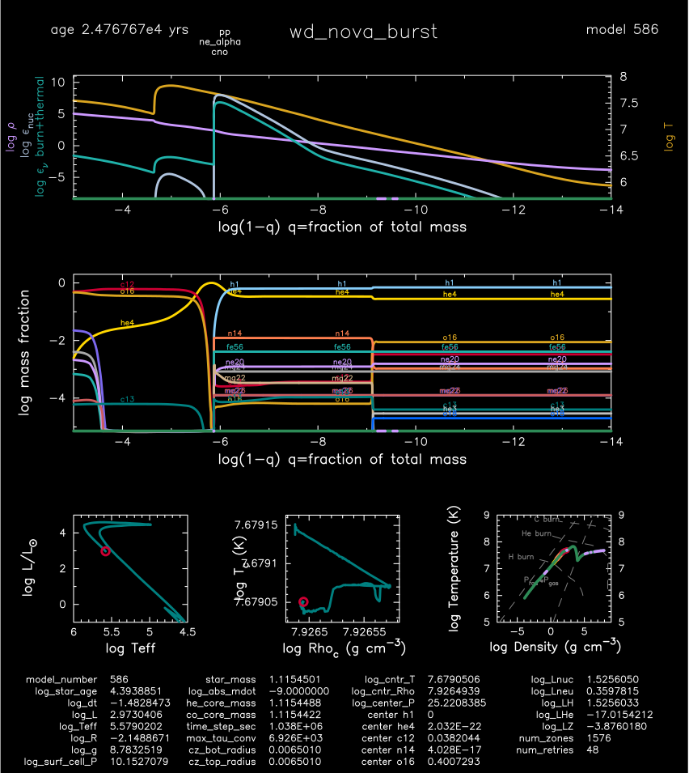

.. _wd_nova_burst:

*************
wd_nova_burst
*************

This test case checks the evolution of a nova outburst for one cycle.

This test case has 2 parts. Click to see a larger version of a plot.

* Part 1 (``inlist_setup``) loads ``1.1M_lgTc_7.7.mod``, a prebuilt carbon ocygen white dwarf from the :ref:`make_o_ne_wd` test suite, sets the topical depth to 30, evolves for a few steps to an age of 1e7 year and terminates.

* Part 2 (``inlist_wd_nova_burst``) continues the evolution with the accretion of a hydrogen-helium mixture at a rate of 1e-9 Msun/yr. Eventually hydrogen burning in the accerted envelope cause sthe luminosity to exceed 1e4 Lsun and an alert is written to the terminat via the ``run_star_extras.f90``:

.. code-block:: console

                                             num_bursts           1
         405   8.277879  4.365E+05   8.624940   8.625037   1.115473   0.000025   0.000000   0.000000   0.309197 329.049014   1497     36
 -5.0945E+00   7.679057  -1.661720  -2.464781   7.731723  -9.000000   1.115449   0.000000   0.400729   0.019380  65.113954     10
  2.4766E+04   7.926520   4.191187   4.972103  -6.862099  -4.289137   1.115442   0.038204   0.474628   1.000000  0.327E-01  max increase
                                rel_E_err   -1.9543755810854924D-08
                        log_rel_run_E_err       -6.0755826271591920

and when the luminosity falls below 1e3 Lsun a nova cycle is considered finished and the run terminates:

.. code-block:: console

         585   7.835616  3.884E+05   1.624521   1.624523   1.115450   0.000001   0.000000   0.000000   0.332277 329.045159   1617     48
 -1.4608E+00   7.679051  -2.147858 -16.859525   0.457865  -9.000000   1.115449   0.000000   0.400729   0.019454  65.113548      5
  2.4768E+04   7.926494   3.015873  -3.748867 -67.588316  -3.897373   1.115442   0.038204   0.474628   1.000000 -0.133E-06        Lnuc_H
                                rel_E_err   -5.3661942520223188D-10
                        log_rel_run_E_err       -5.9590177286527863

  have finished burst

|br|
pgstar commands used for the plots above:

.. code-block:: console

 &pgstar

  file_white_on_black_flag = .true. ! white_on_black flags -- true means white foreground color on black background
  !file_device = 'png'            ! png
  !file_extension = 'png'

  file_device = 'vcps'          ! postscript
  file_extension = 'ps'

          pgstar_interval = 1

         Grid8_win_flag = .true.
         Grid8_win_width = 12
         Grid8_title = 'wd_nova_burst'

         Summary_Burn_xaxis_name = 'logxq' 
         Summary_Burn_xaxis_reversed = .true.
         Summary_Burn_xmin = -14 ! -101d0 ! only used if /= -101d0
         Summary_Burn_xmax = -3 ! -101d0 ! only used if /= -101d0
         Summary_Burn_title = ' '

         Abundance_title = ' '
         Abundance_xaxis_name = 'logxq' 
         Abundance_xaxis_reversed = .true.
         Abundance_xmin = -14 ! -101d0 ! only used if /= -101d0
         Abundance_xmax = -3 ! -101d0 ! only used if /= -101d0
         Abundance_txt_scale = 0.8
         Abundance_legend_max_cnt = 0

         HR_title = ' '
         HR_txt_scale = 0.8
         HR_logT_min = 4.5
         HR_logT_max = 6.0
         HR_logL_min = -1.0
         HR_logL_max = 5.0

         TRho_title = ' '
         TRho_txt_scale = 0.8
         TRho_logT_min = -101d0
         TRho_logT_max = -101d0
         TRho_logRho_min = -101d0
         TRho_logRho_max = -101d0

         TRho_Profile_title = ' '
         TRho_Profile_txt_scale = 0.7
         TRho_Profile_xmin = -8.0
         TRho_Profile_xmax = 9.0
         TRho_Profile_ymin = 5.0
         TRho_Profile_ymax = 9.0

        Text_Summary1_name(5,2) = 'time_step_sec'
        Text_Summary1_name(6,2) = 'max_tau_conv'

        Grid8_file_flag = .true.
        Grid8_file_dir = 'pgstar_out'
        Grid8_file_prefix = 'grid8_'
        Grid8_file_interval = 10000
        Grid8_file_width = -1
        Grid8_file_aspect_ratio = -1

 / ! end of pgstar namelist

Last-Updated: 08Jul2021 (MESA 094ff71) by fxt.

.. # define a hard line break for HTML
.. |br| raw:: html

       
