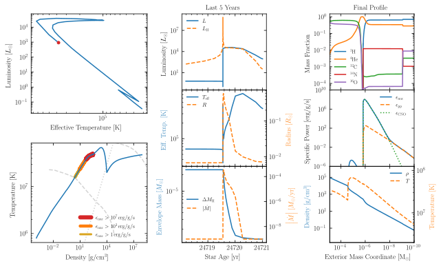

.. _wd_nova_burst:

*************
wd_nova_burst
*************

This test case checks the evolution of a nova outburst for one cycle.

This test case has 2 parts. Click to see a larger version of a plot.

* Part 1 (``inlist_setup``) loads ``1.1M_lgTc_7.7.mod``, a prebuilt carbon-oxygen white dwarf from the :ref:`make_o_ne_wd` test suite, sets the topical depth to 30, evolves for a few steps to an age of 1e7 year and terminates.

* Part 2 (``inlist_wd_nova_burst``) continues the evolution with the accretion of a hydrogen-helium mixture at a rate of 1e-9 Msun/yr. Eventually hydrogen burning in the accerted envelope causes the luminosity to exceed 1e4 Lsun and an alert is written to the terminate via the ``run_star_extras.f90``:

.. code-block:: console

                                             num_bursts           1
         405   8.277879  4.365E+05   8.624940   8.625037   1.115473   0.000025   0.000000   0.000000   0.309197 329.049014   1497     36
 -5.0945E+00   7.679057  -1.661720  -2.464781   7.731723  -9.000000   1.115449   0.000000   0.400729   0.019380  65.113954     10
  2.4766E+04   7.926520   4.191187   4.972103  -6.862099  -4.289137   1.115442   0.038204   0.474628   1.000000  0.327E-01  max increase
                                rel_E_err   -1.9543755810854924D-08
                        log_rel_run_E_err       -6.0755826271591920

and when the luminosity falls below 1e3 Lsun a nova cycle is considered finished and the run terminates:

.. code-block:: console

         585   7.835616  3.884E+05   1.624521   1.624523   1.115450   0.000001   0.000000   0.000000   0.332277 329.045159   1617     48
 -1.4608E+00   7.679051  -2.147858 -16.859525   0.457865  -9.000000   1.115449   0.000000   0.400729   0.019454  65.113548      5
  2.4768E+04   7.926494   3.015873  -3.748867 -67.588316  -3.897373   1.115442   0.038204   0.474628   1.000000 -0.133E-06        Lnuc_H
                                rel_E_err   -5.3661942520223188D-10
                        log_rel_run_E_err       -5.9590177286527863

  have finished burst

The Python script used to create the figures above:

.. literalinclude:: ../../../star/test_suite/wd_nova_burst/plot.py
  :language: python

Last-Updated: 07Aug2024 (MESA 0b40398b) by wmwolf.

Last-Run: 22Dec2025 (MESA fede5937) by pmocz on C916PXT6XW in 586 seconds using 8 threads.
