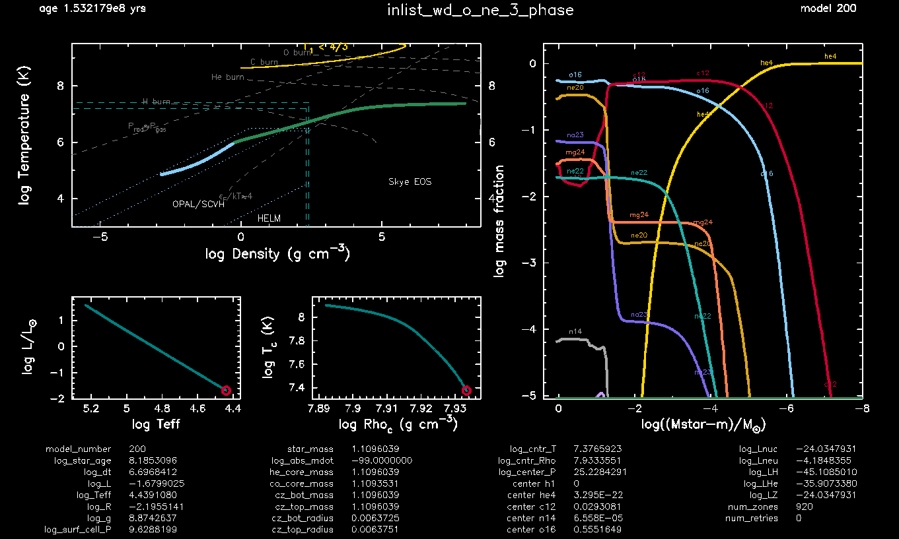
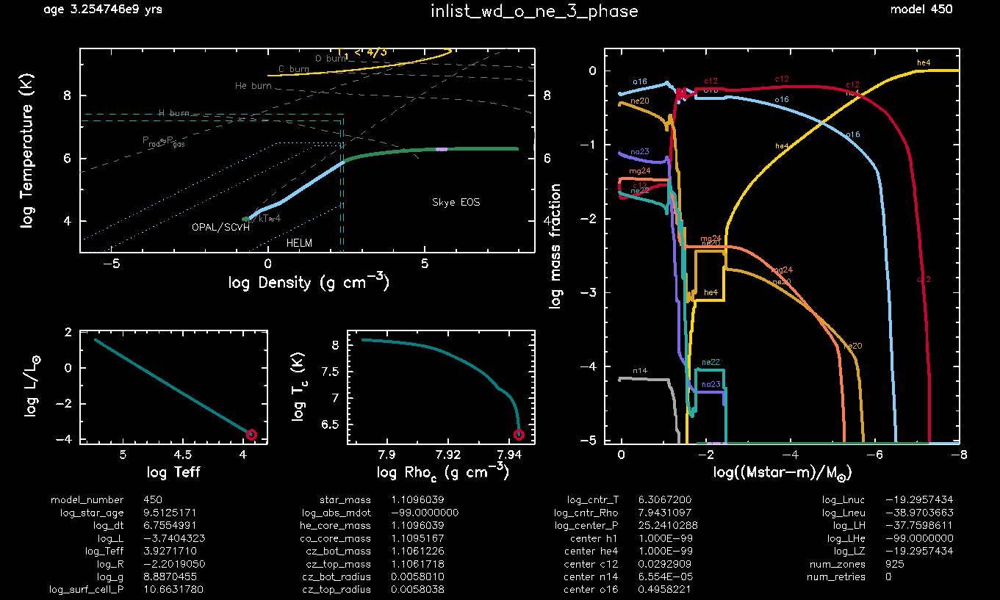

.. _wd_o_ne_3_phase:

***************
wd_o_ne_3_phase
***************

.. tags:: star, white-dwarf, oxygen-neon-white-dwarf, phase-separation, crystallization

This test case demonstrates the implementation of three-component phase separation in an ONeNa white dwarf (see |Castro-TapiaCumming2025|).

**Part 1** (``inlist_create_wd``) (optional) creates an 8.3 M⊙, Z = 0.02 metallicity pre-main-sequence star and evolves it to the end of the AGB phase. The result is a 1.1 M⊙ ONeNa white dwarf. Since this is a "sped-up" method for producing an O/Ne white dwarf, it is recommended to accrete some helium and/or hydrogen onto the surface of the resulting white dwarf to obtain a more accurate cooling model. Alternatively, any white dwarf model can be used as the input model.

**Part 2** (``inlist_wd_o_ne_3_phase``) loads ``wd1_10_mi8_3_ONeNa.mod``, a 1.1 M⊙ ONeNa white dwarf with a helium atmosphere, and evolves it until the core temperature drops below log10(T/K)=6.3.

Throughout the white dwarf cooling phase, phase separation occurs as a result of crystallization. With ``phase_separation_option = '3c'``, the three most abundant elements in the core that transition to the solid phase undergo fractionation, as predicted by ternary phase diagrams.

Example of the cooling before crystallization:

Example with a portion of the core crystallized:

pgstar commands used for the plots above:

.. code-block:: console

 &pgstar

 file_white_on_black_flag = .true. ! white_on_black flags -- true means white foreground color on black background
 file_device = 'png'            ! png
 !file_device = 'vcps'          ! postscript

        Grid2_win_flag = .true.
        Grid2_win_width = 16
        Grid2_title = 'inlist_wd_o_ne_3_phase'
        Grid2_xleft = 0.08
        Grid2_xright = 0.99
        Grid2_ybot = 0.04
        Grid2_ytop = 0.92

        Grid2_file_flag = .true.
        Grid2_file_width = 16
        Grid2_file_interval = 50

        TRho_Profile_xmin = -6.0
        TRho_Profile_xmax = 8.5
        TRho_Profile_ymin = 3.0
        TRho_Profile_ymax = 9.5

        show_TRho_Profile_eos_regions = .true.
        show_TRho_Profile_degeneracy_line = .true.
        show_TRho_Profile_Pgas_Prad_line = .true.
        show_TRho_Profile_burn_lines = .true.
        show_TRho_Profile_burn_labels = .true.
        show_TRho_Profile_text_info = .false.
        TRho_Profile_title =' '

        Abundance_xaxis_name = 'logxm'
        Abundance_xaxis_reversed = .true.
        Abundance_xmin = -8.0
        Abundance_xmax = 0.4
        Abundance_log_mass_frac_min = -5.0
        Abundance_log_mass_frac_max =  0.3
        num_abundance_line_labels = 5
        Abundance_legend_max_cnt = 0
        Abundance_title =' '

        HR_title =' '
        TRho_title =' '

        pgstar_model_coord = 0.96

 / ! end of pgstar namelist

Last-Updated: 30Jul2026 (MESA 26.04.1) by mcastrotapia.

.. |Castro-TapiaCumming2025| replace:: `Castro-Tapia & Cumming 2025 <https://ui.adsabs.harvard.edu/abs/2025ApJ...991...64C/abstract>`__
