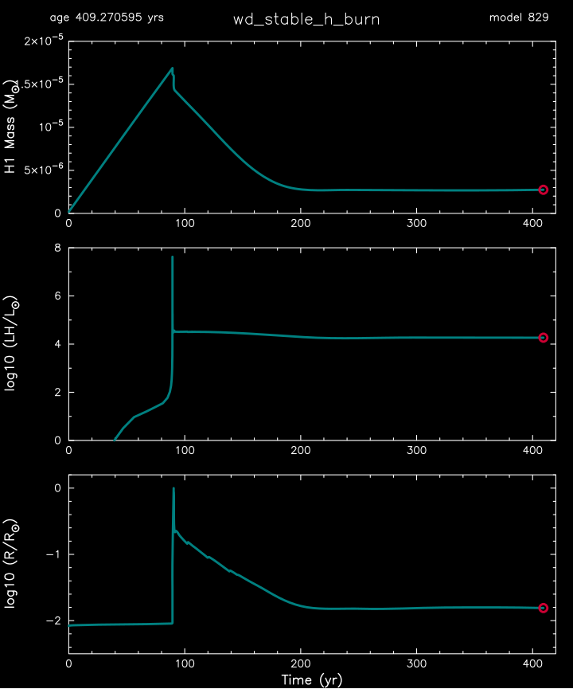

.. _wd_stable_h_burn:

****************
wd_stable_h_burn
****************

This test case checks the evolution stable hydrogen burning on a white dwarf.

This test case has 1 parts. Click to see a larger version of a plot.

* Part 1 (``inlist_wd_stable_h_burn``) loads ``1.1M_lgTc_7.7.mod``, a prebuilt 1.1 Msun carbon oxygen white dwarf from the :ref:`make_co_wd` test suite in r13738 with an an ``initial_mass`` of 6.4 Msun. The mass is relaxed to 1.0 Msun, the optical depth is relaxed to 300, and a hydrogen-rich composition is accreted at 2.5e7 Msun/yr. After about 100 year of evolution there is a hydrogen burning outburst followed by a period of stable hydrogen burning:

|br|
pgstar commands used for the plots above:

.. code-block:: console

 &pgstar

  file_white_on_black_flag = .true. ! white_on_black flags -- true means white foreground color on black background
  !file_device = 'png'            ! png
  !file_extension = 'png'

  file_device = 'vcps'          ! postscript
  file_extension = 'ps'

          pgstar_interval = 1

   pgstar_left_yaxis_label_disp = 4.0

   History_Track1_win_flag = .false.
   History_Track1_win_width = 12
   History_Track1_win_aspect_ratio = 0.75
   History_Track1_txt_scale = 0.8
   History_Track1_title = ' '

   History_Track1_xname = 'star_age'
   History_Track1_yname = 'total_mass_h1'
   History_Track1_xaxis_label = ' '
   History_Track1_yaxis_label = 'H1 Mass (M\d\(2281)\u)'
   History_Track1_reverse_xaxis = .false.
   History_Track1_reverse_yaxis = .false.

   History_Track1_xmin = 0.0
   History_Track1_xmax = 420.0
   History_Track1_ymin = 0.0
   History_Track1_ymax = 2.0e-5

   History_Track1_file_flag = .false.
   History_Track1_file_dir = 'pgstar_out'
   History_Track1_file_prefix = 'track1_'
   History_Track1_file_interval = 10000
   History_Track1_file_width = -1
   History_Track1_file_aspect_ratio = -1

   History_Track2_win_flag = .false.
   History_Track2_win_width = 12
   History_Track2_win_aspect_ratio = 0.75
   History_Track2_txt_scale = 0.8
   History_Track2_title = ' '

   History_Track2_xname = 'star_age'
   History_Track2_yname = 'log_LH'
   History_Track2_xaxis_label = ' '
   History_Track2_yaxis_label = 'log10 (LH/L\d\(2281)\u)'
   History_Track2_reverse_xaxis = .false.
   History_Track2_reverse_yaxis = .false.

   History_Track2_xmin = 0
   History_Track2_xmax = 420.0
   History_Track2_ymin = 0
   History_Track2_ymax = 8.0

   History_Track2_file_flag = .false.
   History_Track2_file_dir = 'pgstar_out'
   History_Track2_file_prefix = 'track2_'
   History_Track2_file_interval = 10000
   History_Track2_file_width = -1
   History_Track2_file_aspect_ratio = -1

   History_Track3_win_flag = .false.
   History_Track3_win_width = 12
   History_Track3_win_aspect_ratio = 0.75
   History_Track3_txt_scale = 0.8
   History_Track3_title = ' '

   History_Track3_xname = 'star_age'
   History_Track3_yname = 'log_R'
   History_Track3_xaxis_label = 'Time (yr)'
   History_Track3_yaxis_label = 'log10 (R/R\d\(2281)\u)'
   History_Track3_reverse_xaxis = .false.
   History_Track3_reverse_yaxis = .false.

   History_Track3_xmin = 0
   History_Track3_xmax = 420.0
   History_Track3_ymin = -2.5
   History_Track3_ymax = 0.2

   History_Track3_file_flag = .false.
   History_Track3_file_dir = 'pgstar_out'
   History_Track3_file_prefix = 'track3_'
   History_Track3_file_interval = 10000
   History_Track3_file_width = -1
   History_Track3_file_aspect_ratio = -1

   Grid1_win_flag = .true.
   Grid1_win_width = 10
   Grid1_win_aspect_ratio = 1.2

   Grid1_plot_name(:) = ''
   Grid1_txt_scale_factor(:) = 1.0 ! multiply txt_scale for subplot by this

   Grid1_title = 'wd_stable_h_burn'

   Grid1_num_cols = 1 ! divide plotting region into this many equal width cols
   Grid1_num_rows = 3 ! divide plotting region into this many equal height rows
   Grid1_num_plots = 3 ! <= 10

   Grid1_plot_name(1) = 'History_Track1'
   Grid1_plot_row(1) = 1           ! number from 1 at top
   Grid1_plot_rowspan(1) = 1       ! plot spans this number of rows
   Grid1_plot_col(1) =  1          ! number from 1 at left
   Grid1_plot_colspan(1) = 1       ! plot spans this number of columns

   Grid1_plot_pad_left(1) = 0.00    ! fraction of full window width for padding on left
   Grid1_plot_pad_right(1) = -0.02   ! fraction of full window width for padding on right
   Grid1_plot_pad_top(1) = -0.02     ! fraction of full window height for padding at top
   Grid1_plot_pad_bot(1) = 0.05     ! fraction of full window height for padding at bottom
   Grid1_txt_scale_factor(1) = 0.8 ! multiply txt_scale for subplot by this

   Grid1_plot_name(2) = 'History_Track2'
   Grid1_plot_row(2) = 2           ! number from 1 at top
   Grid1_plot_rowspan(2) = 1       ! plot spans this number of rows
   Grid1_plot_col(2) =  1          ! number from 1 at left
   Grid1_plot_colspan(2) = 1       ! plot spans this number of columns

   Grid1_plot_pad_left(2) = 0.0    ! fraction of full window width for padding on left
   Grid1_plot_pad_right(2) = -0.02   ! fraction of full window width for padding on right
   Grid1_plot_pad_top(2) = 0.0     ! fraction of full window height for padding at top
   Grid1_plot_pad_bot(2) = 0.00     ! fraction of full window height for padding at bottom
   Grid1_txt_scale_factor(2) = 0.8 ! multiply txt_scale for subplot by this

   Grid1_plot_name(3) = 'History_Track3'
   Grid1_plot_row(3) = 3           ! number from 1 at top
   Grid1_plot_rowspan(3) = 1       ! plot spans this number of rows
   Grid1_plot_col(3) =  1          ! number from 1 at left
   Grid1_plot_colspan(3) = 1       ! plot spans this number of columns

   Grid1_plot_pad_left(3) = 0.0    ! fraction of full window width for padding on left
   Grid1_plot_pad_right(3) = -0.02   ! fraction of full window width for padding on right
   Grid1_plot_pad_top(3) = 0.05     ! fraction of full window height for padding at top
   Grid1_plot_pad_bot(3) = -0.03     ! fraction of full window height for padding at bottom
   Grid1_txt_scale_factor(3) = 0.8 ! multiply txt_scale for subplot by this

   Grid1_file_flag = .true.
   Grid1_file_dir = 'pgstar_out'
   Grid1_file_prefix = 'grid_'
   Grid1_file_interval = 10000
   Grid1_file_width = -1        
   Grid1_file_aspect_ratio = -1 

 / ! end of pgstar namelist

Last-Updated: 08Jul2021 (MESA 094ff71) by fxt.

.. # define a hard line break for HTML
.. |br| raw:: html

       
